# 2023年2月

## 2月28日

## 2月27日

## 2月26日
今天是下跌的第六天，一看都下探到23000以下，但今天有止跌迹象。
- [加密创始人可以从 Blur 的代币空投中学到什么？](https://mp.weixin.qq.com/s/do6SIRZVkopzZw9AcWUIwA)

## 2月25日
今天是下跌的第五天，跌到不忍直视的程度。继续与美股联动：[美股收盘：关键通胀反弹加剧恐慌情绪 三大指数经历今年最差一周](https://feeds-drcn.cloud.huawei.com.cn/landingpage/latest?docid=10510281277715&to_app=hwbrowser&dy_scenario=push&tn=30bf59a2bd6cbb326fccfe7dd38f5b8f1947c60b66bf05e130190d7b22bf11b9&share_to=weixin&ctype=news&appid=hwbrowser&cpid=666&r=CN)

- 孙宇晨将约 15 万枚 ETH 质押到 Lido 兑换成 stETH  
Lido 称，该协议记录了迄今为止最大的每日流入，协议安全功能被激活，称为 Staking Rate Limit。此限制会影响可能尝试铸造 stETH 的所有各方。由于恢复速度(约 6.2K ETH 每小时) ，大多数用户不太可能受到影响。
- Solana 网络今日清晨经历分叉事件  
此事件限制了用户执行交易和转账的能力，导致网络每秒只能处理约 93 笔交易，远低于分叉前该网络接近 5000 TPS 的速率。目前暂不清楚是什么原因导致了分叉事件。验证者和 Solana 工程师正在讨论一系列选项，包括可能的网络重启或软件降级。
- Bitcoin Core 本周动态汇总。  
强监管往往是一个新生事物发展到成熟阶段的标志（意味着大幅增值的机会降低，当然需要一定的时间）
    -  Bitcoin Core 代码管理员 Wladimir van der Laan 已于本周四离职。一名 Bitcoin Core 代码管理员已于本周四离职，当前拥有比特币代码修改权限的仅剩 5 人。在过去的 18 个月里，有 4 位 Bitcoin Core 维护者以身心疲劳或法律风险为由辞职。Wladimir van der Laan于 2014 年成为首席维护者，但在过去两年中一直试图退出这一角色。应他自己的要求，他对 Bitcoin Core 的 GitHub 存储库的访问权限最终于周四被取消。
    -  Bitcoin Core 开发者 Marco Falke 将于今年夏天辞去维护者的职务。Bitcoin Core 开发者 Marco Falke 在其 2 月21 日发布的推文中表示，其将于今年夏天辞去维护者的职务。在他比特币核心贡献者的七年任期内，Falke 收集了超过 2,000 个被称为 “commits” 的软件更改建议，是平台最多产的贡献者。此前另外一个 Bitcoin Core 代码管理员 Wladimir van der Laan 于 2 月 16 日辞职。

## 2月24日
今天是下跌的第四天，行情平淡。BTC在23000-24000之间  
- okt减产算是大新闻了，通胀模型变更，今天最高到37.61。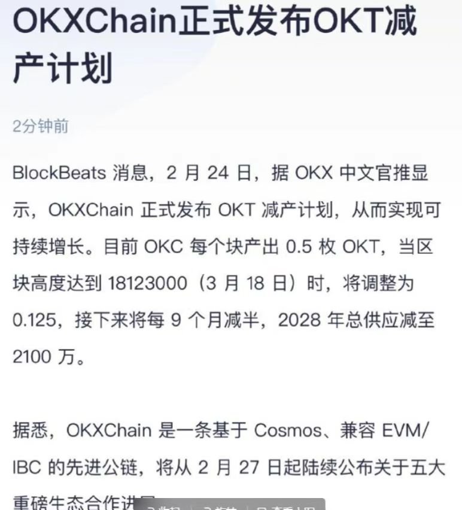
- BULR关键总量30亿的量，现在流通的才3.6亿，还有26.4亿的体量释放啊。虽然做的opensea的事儿，交易体量超过老大，如果是按照现在的体量还可以，以后空投+释放出来的，会不会砸到地板上。
- GPTChat概念还没熄火，反复炒作。

## 2月23日
下跌第三天，价格又下一个台阶，BTC跌破24000，其他跟着跌，跌幅不忍直视。  
今天没有热点，适合学习。  
- Immutable X开发公司裁员11%。昨天polygon labs裁员20%，约100名员工受影响。

## 2月22日
下跌第二天
- 还是香港的新闻  
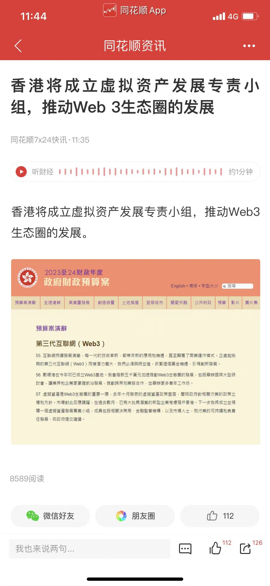  

## 2月21日
又一张老照片。

再次验证，孙割一到，果然大跌。

【孙哥逃顶指数】，简单说就是看到孙哥宣布参与的项目，不用多想，逃跑就行。接下来，用历史数据复盘看下准确率 ！！！

17年，孙哥预告发ICO（后来的波场），1个月后94，所有ICO清退 ！

18年，孙哥来了个IEO（btt），一个月后IEO板块暴跌！

拍下巴菲特午餐，要给老巴介绍币圈，结果1个月内币圈暴跌 ！

20年蹭DeFi，在波场发布uni仿制项目，上线当天带崩uni、sushi、yfi 

21年推特预热有trx重大新闻，第二天全体山寨跌幅10%-20% 

21年11月孙哥的赛马预售完，第二天农民世界崩盘，链游集体跳水

22年5月5日孙哥上线稳定币USDD，5月9日稳定币UST脱钩 然后就是luna崩盘！lunc归零

22年6月9日说开启自己的交易所，6月19日虎符无法提现 ！

23年2月8日宣布入场AI，AI崩 

 2月10日跑步入场LSD，LSD赛道大跌

一次，可以认为是偶然，但是十战十胜，而且经历了时间的考验，这时候，玄学也能上升到科学。

【孙哥指标】那年他双手插兜，不知道什么是对手！ 

## 2月20日
BTC，已经第二次突破25000后下来。  
- 香港概念的行情起来以后，有人说 Conflux 是代表公链、Alchemy Pay 代表入金、SelfKey 则是合法 KYC，此为三驾马车；有人说香港概念让人想到从前中国项目波澜壮阔的庄币炒作，然后开始想象一轮 VET、QKC、NEO 的老妖出山；更有大量海外 KOL 争相探讨香港基本面逻辑，其中不乏有了解情况的人进行了「Ponzi」警告。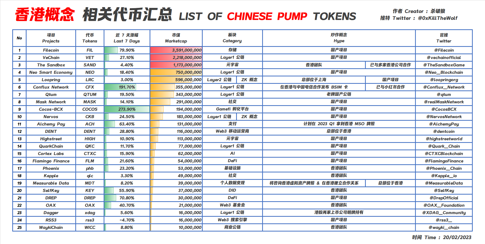
- [Filecoin 一周内上涨超过 80%——值得关注的关键水平](https://followin.io/zh-Hans/feed/3075336)。据官方博客，Filecoin虚拟机（FVM）将于3月14日在Filecoin主网上启动。 Filecoin EVM将通过Filecoin nv18 Hygge升级部署在Filecoin主网上。
- [新公链Sui将于一季度上线主网，手把手教你如何进行测试网交互](https://www.panewslab.com/zh/articledetails/6d73ujqj.html)

今天又一次见到这张图，做个纪念。

## 2月19日
BTC在23000-25000之间盘整，构筑一个成交密集区。

[一周精选丨Blur首轮空投落地，NFT市场回暖；SEC禁止BUSD继续发行；宏观、监管传利空，大盘依旧稳固](https://www.panewslab.com/zh/articledetails/jw6rmsws.html)
- opensea与blur打仗，blur一路上涨，好像错过了什么。面对blur市场蚕食，Opensea终于感受到危机，最终或许绕不开发币：一，启动限时0手续费交易活动；二，启用最低标准为0.5%的可选版权服务，适用所有非链上强制执行版税的系列；三，更新运营商过滤器，以允许拥有相同政策的NFT市场可以共同增加市场流动性。
- 未来牛市发动机。1.DeFi、稳定币，本质是杠杆牛；2.NFT，铲子；3.链游，吸引流量进圈；4，Chain（合规交易所；比特币现货ETF；港元稳定币，人民币稳定币）
- LSD赛道 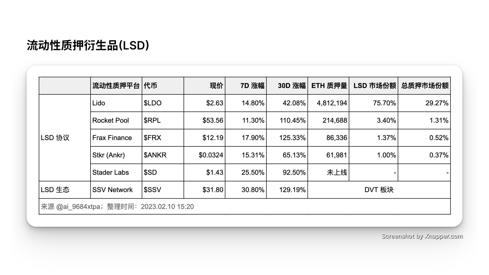 

[Pantera Capital报告：第七个牛市周期](https://www.panewslab.com/zh/articledetails/q50ejswu.html)  
BTC价格周期 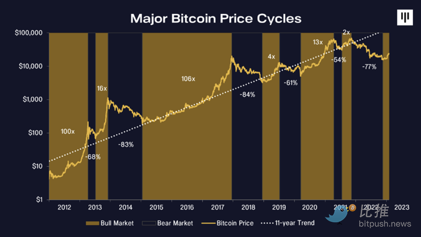 

## 2月18日
老的币种补涨，比如Link，uni，ksm，EOS等。  
质押赛道Ldo达到3以上。  
[挖矿收益翻8倍！ Conflux一夜飙涨211%，$CFX成GPU矿工首选](https://followin.io/zh-Hans/feed/3044593)

## 2月17日
fil成为今天最靓的仔。okt跌到24都没刹住车，又到23+，唉...  
昨晚向上突破2.5万美元后，迅速下跌，已经是老习惯了，先上涨后下跌。okt跌哭了，从30到24。  
- YGG 宣布以售出代币的形式获得 1380 万美元融资，a16z Crypto 和 DWF Labs 领投，该资金将用于进一步开发其灵魂绑定代币 （SBT）。据悉，YGG 新的声望代币于去年测试推出，但仅对内容创作等行会内活动给予奖励。 YGG 表示将与开发商合作，将代币作为任务奖励直接放入游戏中。（难怪今天涨这么多，新高）
- 美联储圣路易斯联储行长布拉德(James Bullard)周四表示，倾向于美联储加息至 5.375% 的利率峰值，希望以最快的速度达到；他曾在 2 月会议上建议FOMC加息 50 个基点；不排除 3 月支持加息 50 个基点的可能性。该发言发表后纳斯达克与加密市场大幅下挫。
- 据 WSJ 报道，一名 Bitcoin Core 代码管理员已于本周四离职，当前拥有比特币代码修改权限的仅剩 5 人。在过去的 18 个月里，有 4 位 Bitcoin Core 维护者以身心疲劳或法律风险为由辞职。Wladimir van der Laan于 2014 年成为首席维护者，但在过去两年中一直试图退出这一角色。应他自己的要求，他对 Bitcoin Core 的 GitHub 存储库的访问权限最终于周四被取消。
- 一条关于香港6月1日所有公民进行加密货币交易完全合法的谣言由 Coinbase CEO 转推引发关注；行业人士指出，香港合规化的影响目前仍不明晰，例如反洗钱条例修订在立法会通过之后，就要做强制性的牌照制管理，即任何加密货币相关业务都需要持牌管理，广告都处于严格的禁止与打击之列；对于个人投资者的开放目前尚在讨论之中，目前只对机构与专业投资者开放。
- PANews 2月16日消息，CrossSpace创始人Leon向PANews表示，和香港虚拟资产监管部门的朋友澄清了一下今天有关6月1日散户交易虚拟资产的传闻。其称：1. 6月1日这个时间点是相关立法正式生效，SFC将会有权利发牌给交易所并执行监管；2. 具体的行业指引，下周会有公开咨询，6月1日之前会根据公开咨询的反馈定稿；3. 具体的监管规则，给散户开放的程度，要看下周的公开咨询文件才知道细节。
- [150亿美元稳定币帝国的四年起落：BUSD的野心与遗憾](https://www.theblockbeats.info/news/34682)    [CZ AMA要点总结：监管正在收紧；NFT技术可能性只展示了冰山一角](https://www.theblockbeats.info/news/34757)

## 2月16日
今天大涨（狂暴大牛市来了吗），BTC再次突破新高，到25000+，突破2022年8月（半年）以来新高。  
很多都破新高。1月份部分热门币还没有（apt），但也有一部分涨幅很大。  
OKB大新闻来了（抛弃OKT）  
okbchain与okxchain区别 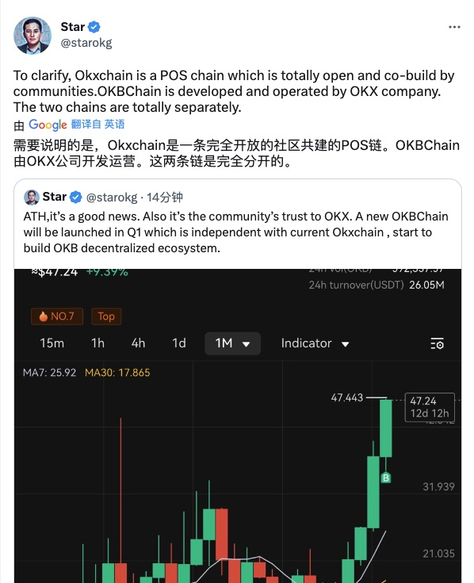  
okbchain将于Q1上线 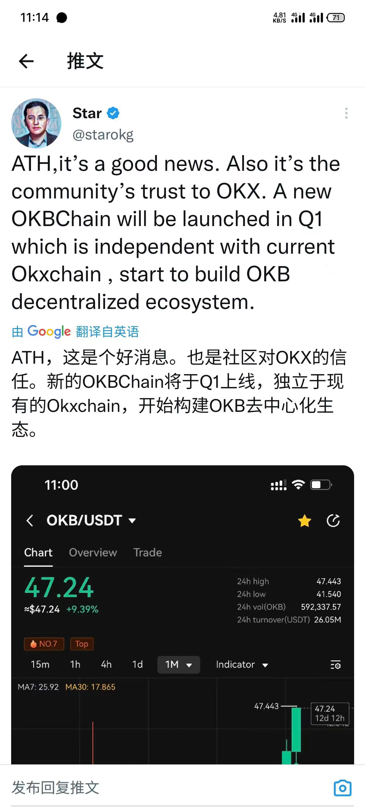  
okbchain与okxchain完全分开 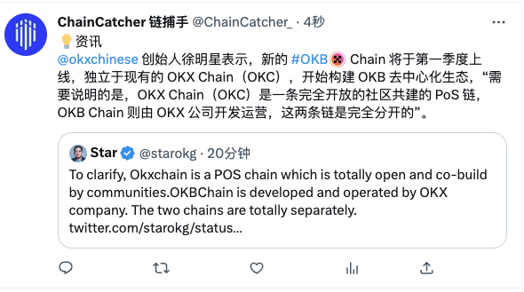
- 2023年6月1日，香港将正式使其所有公民的加密买卖、交易完全合法。期待大量大资金从东方涌入，香港也将退出基于亚洲货币的稳定币。
- 币安CSO：公司预计将支付罚款以解决美国的调查。2月16日消息，币安首席战略官Patrick Hillmann在接受采访时表示，该公司预计将支付罚款，以解决美国监管和执法部门对其业务的现有调查。 Patrick Hillmann表示，币安发展迅速，最初是一家由软件工程师推动的企业，他们不熟悉为解决贿赂和腐败、洗钱和经济制裁风险而制定的法律和规则，该公司一直在努力填补早期合规工作中的空白，但仍预计监管机构将对过去的行为处以罚款。（华尔街日报）
- cfx真起飞了，最高到0.11。本来不打算关注，但涨幅真大。昨天的新闻：Conflux Network 宣布将与中国电信合作于今年晚些时候在香港推出首个 BSIM 试点项目。据悉，BSIM 卡集成了 Conflux 的树图、双重权益证明和工作量证明技术，可为世界上任何区块链实现最高的系统性能。Conflux 希望该行为可以降低用户进入 Web3 和 Metaverse 的门槛。

## 2月15日
今天普涨，有几个币创新高，比如Dash，TRX，反而是热门赛道的很蔫。  
距离2月8日下跌，已经一周了，最恐慌的时候是美国说staking是证券，要纳入监管。  

- 据 CoinDesk 报道，BNB Chain 计划今年做出重大改进，包括对 Web3 应用程序的升级、为开发人员和用户提供实时技术支持的链上通信层，以及从监管和合规角度解锁新隐私用例的方法。BNB Chain 表示 2023 年其目标是将验证者的数量从 29 个增加两倍以上，达到 100 个；将吞吐量从 1.4 亿 gas 限制和 2,200 TPS 提高到 3 亿 gas 限制和 5,000 TPS；此外还有 L2 基础设施 zkBNB 和 BNB Greenfield 的主网启动。

- 据 coingecko 数据，BLUR 上线后在 OKX 上最高达 8.36 美元，现报 0.78 美元，交易量超 8.6 亿美元。据 Dune 数据，3.6 亿枚 BLUR 空投已被领取 88%（约 3.2 亿枚），其中 45.7% 的空投数量在 1k-10k 之间，34.5% 的空投数量在 100-1k 之间，最大空投数量未 320 万枚 BLUR。标记为台湾歌手黄立成的“machibigbrother.eth”地址在 BLUR 此轮空投中获得约 185 万枚 BLUR，当前价值超过 154 万美元。黄立成曾因为大量发行 ICO 而遭到社区揭露与批评。

blur上线第一天，都在吐槽blur割韭菜。 比如：  
Blur的项目方前10分钟8美金砸到1美金，明牌割韭菜

1.前戏，拿空投先看空投前的动效3分钟

2.提示IP受限切IP要1-2分钟

3.切完IP回来重新看动效又3分钟

4.Claim要2分钟

5.如果转到CEX要至少3分钟，在CEX授权代币3分钟

前10分钟整个市场只有项目方做市的币在卖，从8卖到1

[Blur公布代币经济模型：51%分配给社区，29%分配给核心贡献者](https://www.panewslab.com/zh/articledetails/f0welbn8.html)

- 观点
    - 昨天 $Blur 这波灵车又让不少人破产了。NFT赛道水太深，少玩，这轮周期里机会很大，但是镰刀多，特别是国人图狗，断魂十八割，一波流嗷嗷叫。要想赚钱只能在核心圈，或者认知水平超高，连币圈的很多土狗赔率还不如。你本来一个周期能赚十倍以上，但是很多人却会在这个赛道直接葬送一个周期的红利。

## 2月14日
今天美股上涨，币圈下跌后又回来，基本稳住。  
blur上交易所，合理价格0.13-0.28，详情： 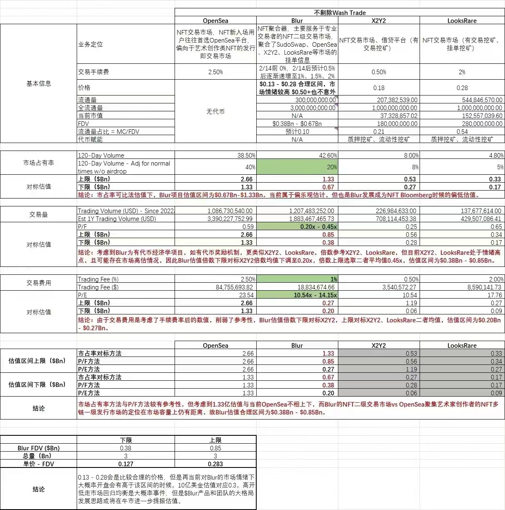

## 2月13日
又是下跌的一天，利空满满。sec计划起诉Paxos发行的BUSD是未注册证券  
BUSD开始脱锚 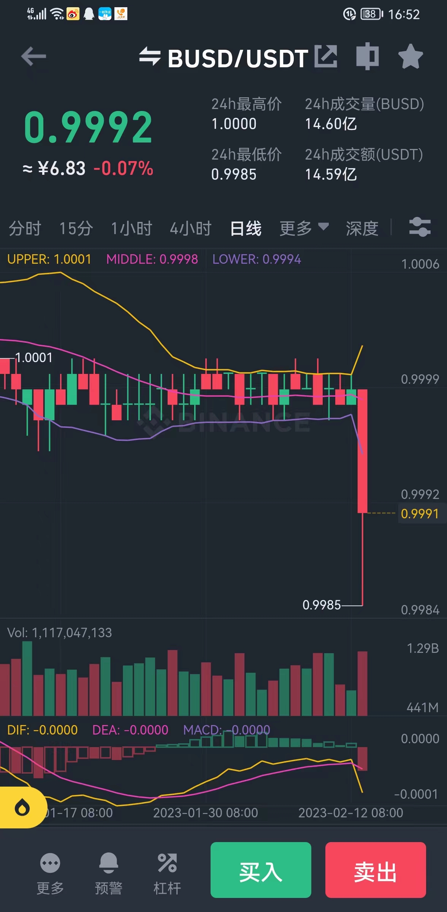  
与USDT兑换比例现为1:0.9988 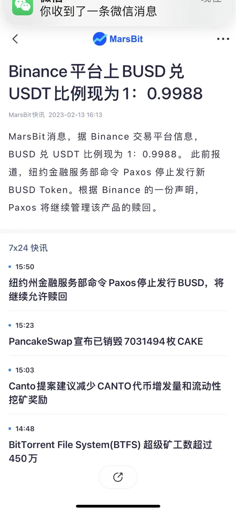  
华尔街日报：美国SEC计划起诉Paxos发行的BUSD是未注册证券 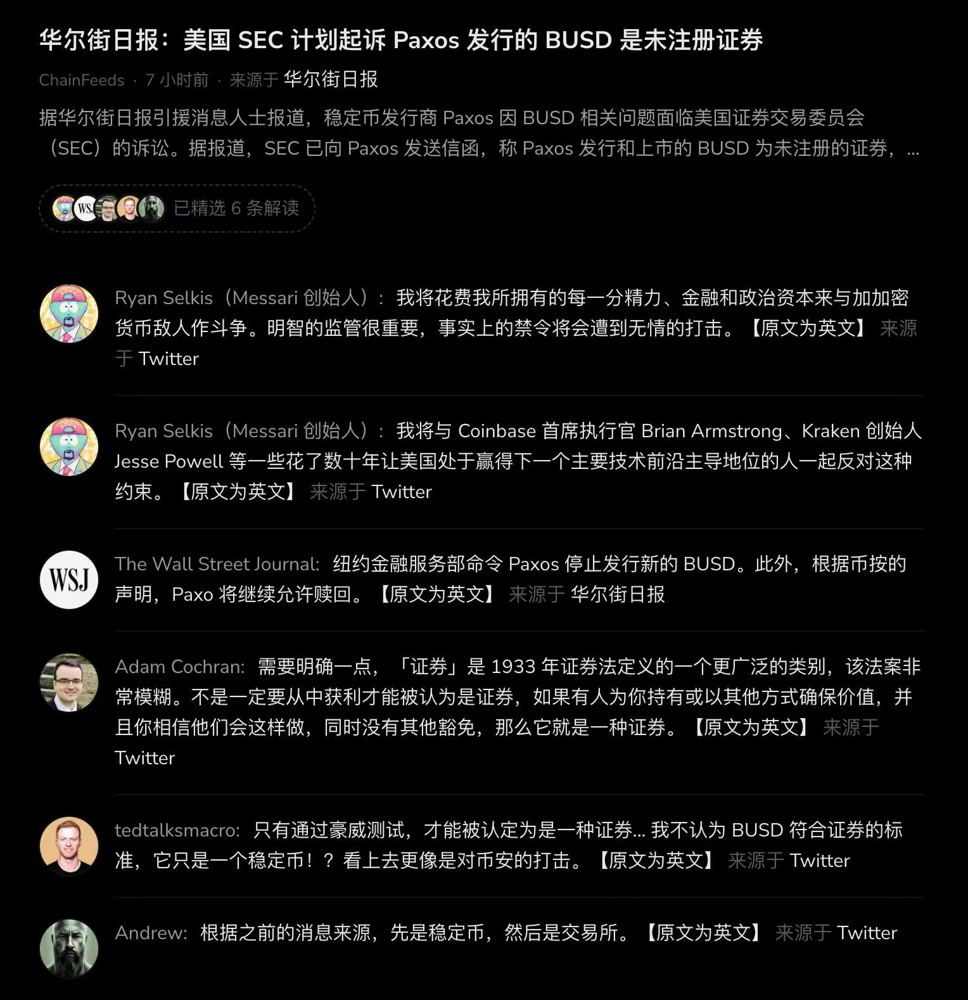  
CZ回应Paxos事件：BUSD不由币安发行或赎回 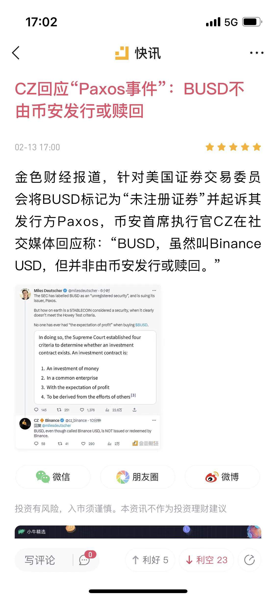  
CZ：未来或不在使用BUSD作为主要交易货币 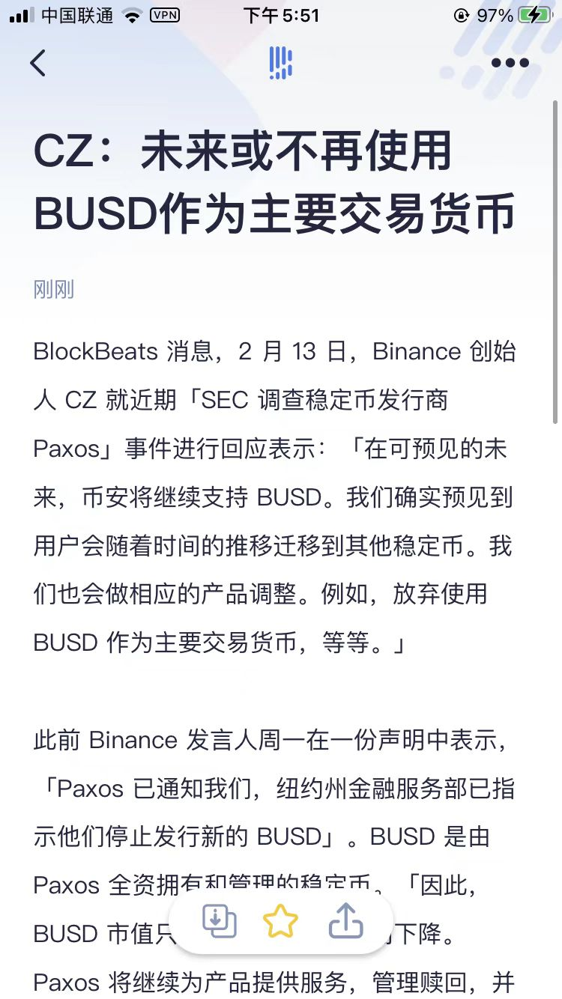  

## 2月12日
昨晚主流币企稳反弹。部分热门赛道小币种已经上涨至下跌前价格。非热门赛道跟随主流币。

解析：为什么SEC要“禁止质押”，以及禁止到了什么程度？边界和范围在哪里？  
因为交易所得天独厚的优势可以汇集大量用户资金去做质押吸储，目前四大机构Lido、Coinbase、Kraken 和 Binance 基本垄断了质押资金，除了Lido其他三个都是中心化交易所，中心化的问题就是在于黑盒根本不知道这些说是质押的钱到底被拿去干嘛了  
首先看到SEC说Kraken给用户宣传有高达21%的APR，而我之前说过目前POS质押的APR在5%左右，所以这个宣传数字是压根不可能实现的  
因为交易所质押模式门槛非常低人人可参与，黑盒无监管再加上夸张的收益数字，如果暴雷这就是下个FTX  
通过官方文件可以看到“将加密资产汇集起来，并代表投资者进行质押...投资者失去控制权..承担风险..无任何保护”  
最后强调“质押即服务提供商必须注册且提供全面公平真实的投资者保护”  

这次SEC是瞄准的质押即服务提供商，并重点打黑盒的交易所，理由是离谱的收益宣传和超高的储户风险。对于原生质押或去中心化质押则不在打击范围内。  
原文：[查看](https://mp.weixin.qq.com/s/7Z9cDEOTbbCOYeIbuC9qFQ)

## 2月11日
以太坊基金会：即将进行支持提款的Shapella升级
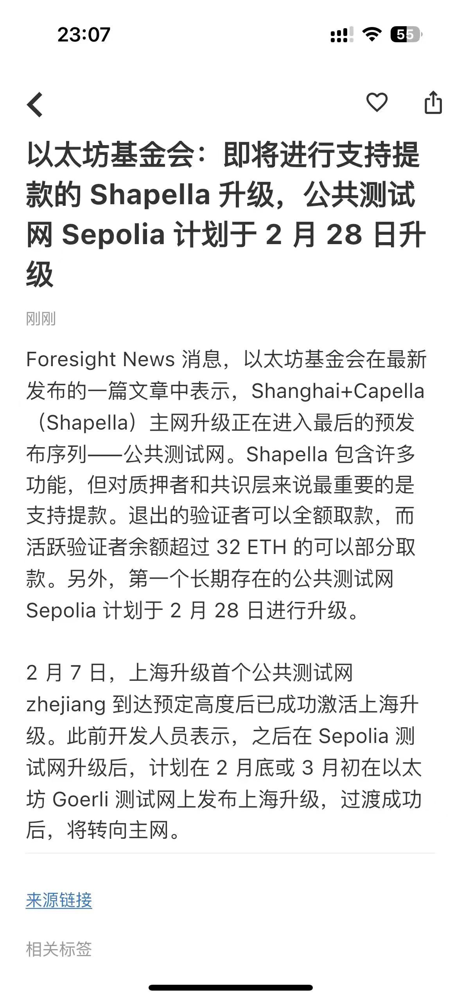

## 2月10日
发酵两天的大利空（美国版94事件），引起暴跌。  
过去24小时Coinbase已将47.2亿USDC转至Circle处销毁
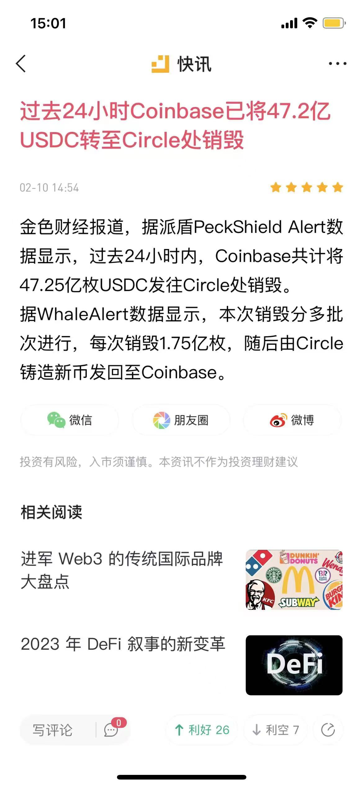
SEC态度表明以下三点是明确的
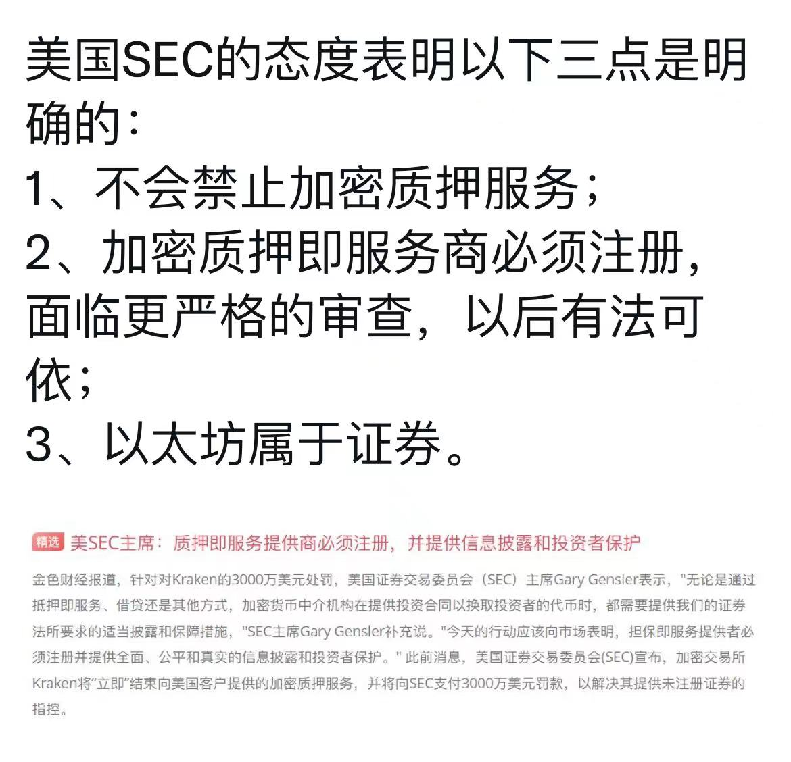
[美国SEC主席亲自出镜解读：为什么Staking平台需要遵守美国证券法](https://m.jinse.com/blockchain/3051147.html?source=m)

## 2月9日
今天大幅下跌，传言美国禁止staking，这利空杠杠的。
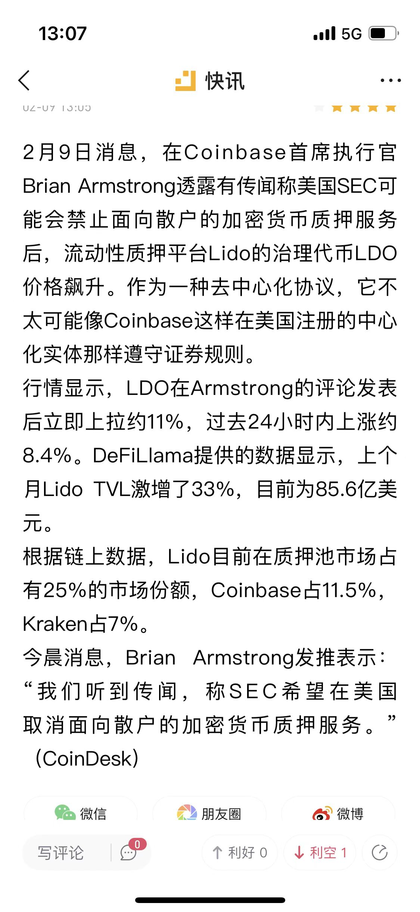
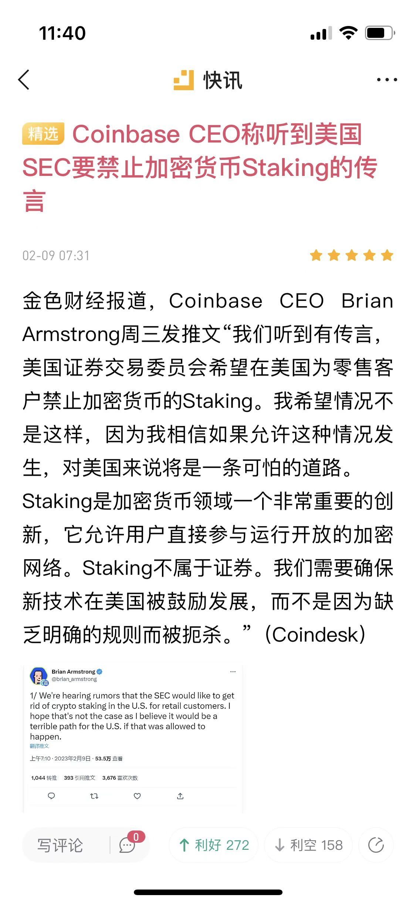

## 2月8日
第一波小幅下跌。不要问我为什么知道今天下跌，是因为早上买了。

## 2月5日
第一波造富神话。  
[30天，我用25万赚到450万](https://followin.io/zh-Hans/feed/2727778)

## 2月2日
凌晨加息25基点后，早上由跌转涨。OP/FIL/LTC/DYDX涨幅较大。BTC/ETH虽创新高，但中规中矩。非热点表现一般。

## 2月1日
1月份涨跌幅token盘点  
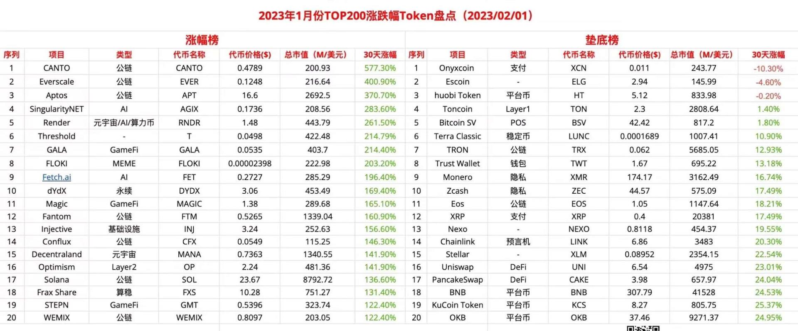  
5年前的今天，看完感慨良多
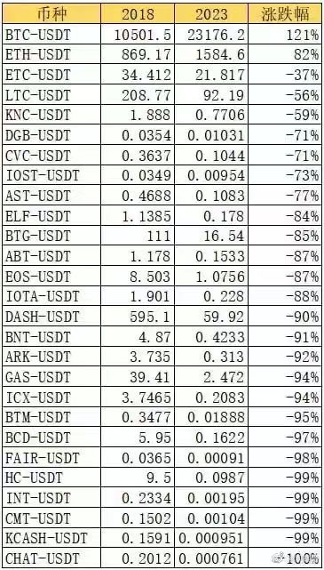