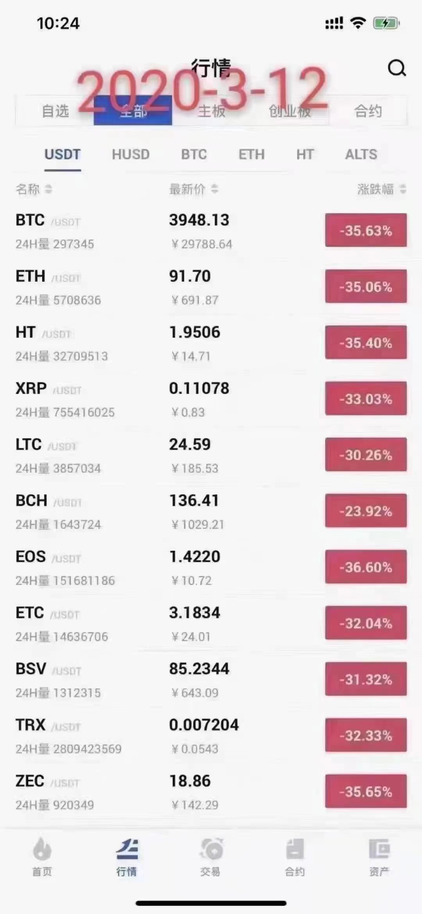
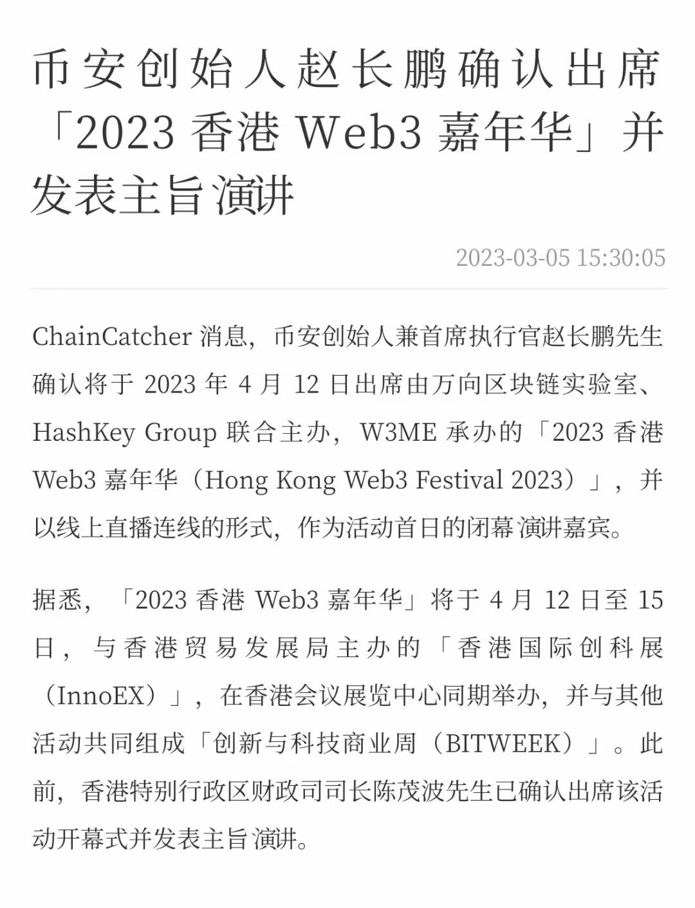
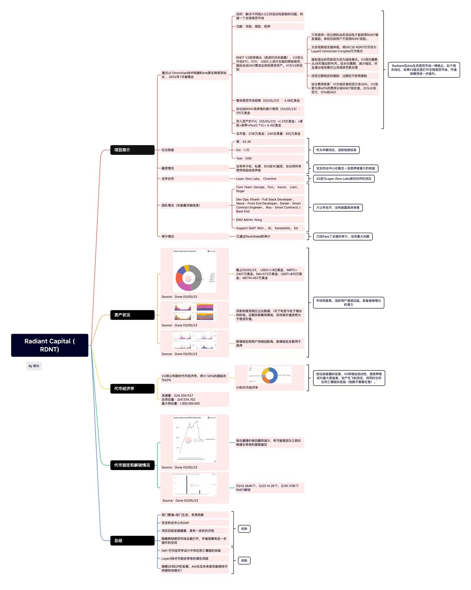

# 2023年3月

## 3月7日
下跌的第8天。其实BTC，ETH一直在横盘，只是其他币在跌。okb又下一个台阶到47，昨天是48。
- blur 估值：0.3美元，市值10亿美元。10倍币有机会，百倍币没戏。某大V 1.2成本，另一个博主0.6成本。
- [cz早期视频(2018) 幣安快速崛起的秘密與全球戰略](https://mp.weixin.qq.com/s/X-L-mLQRryZMfvo7yIo5Jg)
心得体会：没有人可以偶然成功，偶然成功可一时，但不能持久。
- 有人又把312截图发出来了，

## 3月6日
- okb大跌到48，可能是受美国调查币安的影响。由此得出，2025应该是巅峰，接下来你懂的（买预期卖事实）。
- 币安也不全是利空。
- blur介绍（零交易费/更快的扫货速度/自定义版税）。NFT交易市场80%交易量都是大户。[视频](https://www.youtube.com/watch?v=Ff4Bc6X62AU)。blur：[官网](https://blur.io/)
- 存储赛道浅析，ssv浅析。[视频](https://www.youtube.com/watch?v=KtGW_Bx4Mq0)

## 3月5日
下跌第6天，止跌后，弱势横盘。
- RDNT代币详情。
- [凉兮与U商撕逼，爆出U商数十亿黑产和地下钱庄！！！](https://mp.weixin.qq.com/s/UHmS_UCxlfaazDvaZfQLAg)

## 3月4日
下跌第5天，继续下跌。

## 3月3日
上午大瀑布了。
- 大瀑布原因。 

## 3月2日
下跌后弱势震荡。

## 3月1日
今天是下跌的第2天。质押赛道终于也跌了，再也没有热点。但下午BTC/ETH又涨回来了，但好多币没跟着回来。
- 今天有人跟凉兮撕逼。图就不发了。
- 3月财经日历，热点有op,fil,okt,axs。 