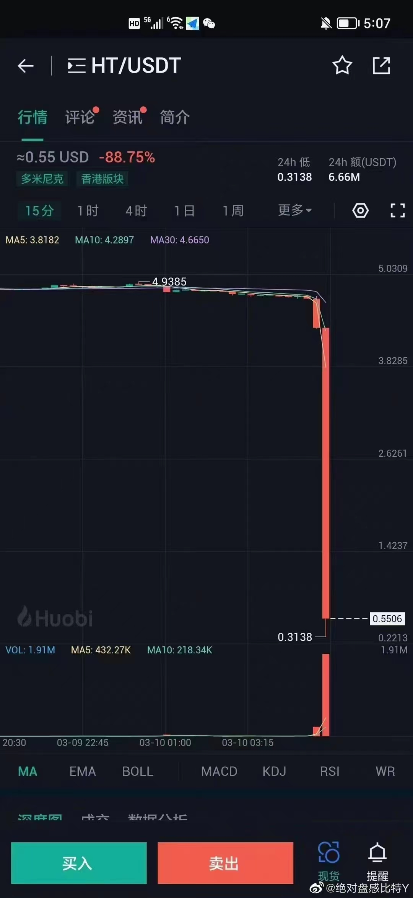

# 2023年3月

## 3月14日
今天稳住了。  
晚上20:30，CPI符合预期，又一波大涨。

- 美国银行系统的存款量正以有史以来最快的速度下降。钱不值钱的原因吧。  
3月13日讯，美联储周末的行动表明，它担心银行可能出现进一步的兴兑。美联储开创了为所有银行存款提供担保的先例，而不仅仅是那些低于美国联邦存款保险公司设定的25万美元上限的存款。但美国银行业中存款外流的现象仍不仅限于硅谷银行，美国储户正以至少是自上世纪70 年代以来最快的速度从银行系统提取资金。存款量的下降是极不寻常的，此前唯一一次出现这种现象是在上世纪 90年代初 (美国经济衰退之后)当时的存款最大跌幅也仅为0.6%，而在截至今年2月的12个月里，美国商业银行的存款量已经下降了 2.5%。
- 银行破产对BTC是大利好。中心化银行🏦苦天下大众久已！  区块链去中心化大势所趋，民心所向！暴涨是对中心化集权对抗的表现！
- 2013年3月16日，因为欧洲债务危机导致塞浦路斯银行大量亏损，塞浦路斯央行宣布对银行客户的存款进行削减和收取本金折扣，这一措施引发了公众的强烈抗议和银行挤兑，许多人试图将资产转换为比特币或转移到其他银行。比特币价格开始上涨，在接下来的几个月里，比特币价格从每枚约40美元的水平上涨到每枚约230美元的水平，涨幅接近500%。
- 富豪们的钱没地方藏，本来美国银行安全，现在也不安全了。瑞士也不安全。总不能买一推黄金。
瑞士跟随美国冻结俄罗斯人资产的后果正在显现。在俄乌冲突后，瑞士几乎完全抛弃了中立国身份，官方和银行一共冻结了价值至少270亿美元的俄罗斯资产。这种强硬态度，已经让其他国家的客户对瑞士银行的信誉打上了问号。瑞士各大银行高管最近指出，来自中国的富豪，现在越来越不敢把钱存在瑞士了。
- CME FedWatch显示，预计联邦储备委员会将在3月份加息25个基点，随后在6月份降息25个基点。预测到今年年底将会有总共四次降息，使利率范围降至3.75-4%。
- CPI数据公布在即，牛市全面来袭？
- 20:30 CPI预期与实际公布一致。
- 宝二爷：比特币会涨到美元归零为止。

## 3月13日
早上一看，久违的大涨，又回来了。LDO等暴力拉升。周末硅谷银行的黑天鹅，应该就是这轮调整的底部了。  
晚上在看，币圈开始疯涨。难道25个基点也不加了吗？（横在4.5%-4.75%之间吗）

硅谷银行后续：
- 官方发布 [一夜变天：美联储出手救市 USDC危机解除 加密友好银行 Signature 被关闭](svb.md)
- 加息会导致更多银行暴雷。估计3月22日会收敛，最多25个基点（4.75%-5%），且本轮加息周期结束。
- CZ: Given the changes in stable coins and banks #Binance will convert the remaining of the $1billion Industry Recovery lnitiative funds fromBUSD to native crypto, including #BTC #BNB and ETH. Some fund movements willoccur on-chain.Transparency.
大V的提示：

## 3月12日
从后来看，下跌的第13天，也是起涨的第一天。  
usdc又活过来了。昨晚通过数据，也发现usdc并没有那么恐怖。但还是害怕，主要是受某v的影响，以后知道该怎么做了。

BTC，ETH涨回来了，但其他币下去就再也没有上来。差距出来了。

今天不恐慌了，但价格也上来了。市场就是这样。

陆续报道：
- 有巨鲸在利用 USDC 套利。
- v神都买了，也算是一种信号。昨天就看到了，但还是在恐慌情绪中，感觉要完蛋，归零的感觉。
V神铸造 15w RAI 兑换为约 40w USDC 以及 27w DA
vitalik.eth 地址今日累计将 500 ETH 铸造为 15w RAI，再将 RAI 兑换为约40w USDC 以及 2.7w DAl 。据了解，Reflexer (RAI) 是由 ETH 支持的-个算法稳定币，使用反射指数而不是其他去中心化稳定币中所见的挂钩机制来运行 (即 RAI 价格不挂钩美元) ，Vitalik 曾表态看好 RAI 的模型。

- 后来弄清楚硅谷银行破产原因是：是加息造成的。之前给用户0.25-0.5%利息，买国债1.5-1.75%，现在加息到5%，债权贬值导致息差变负数，由于赎回潮导致无法兑现，宣布破产。

最悲观的一个朋友圈分享是：硅谷银行破产只是开始。这种言论，永远让你感觉害怕。其实弄清楚的人都知道美国政府不破产，硅谷银行就没事。

## 3月11日
下跌第12天，也是最悲观的一天。感觉世界都要崩塌了。
1. 早上行情稳在底部，有一些币种反弹。  
- 昨晚21:30，美国公布 2 月季调后非农就业人口录得增加 31.1万人，2 月失业率 3.6%，预期 3.4%，前值 3.4%。非农数据公布后，美股股指期货直线拉升，纳指期货涨0.5%，标普500指数期货转涨0.3%，道指期货转涨。
- 还记得昨天有新闻报道加密货币市值再次跌破1万亿美元，进入几千亿美元。相信2-3年后，会觉得是一个好机会。
- 孙哥又在派送空气币换大家价值币了。
- 似乎知道为什么下跌了。原来是机构在抛售资产。还有老美政府没收的几万BTC。
据 @ArkhamIntel分析，Voyager Digital 过去 6 周抛售了其超 3.5 亿美元的链上资产，使用 Binance US、Coinbase 并通过 Wintermute 直接进行场外交易，以清算资产。仅自 3 月初以来，Voyager 就通过 25 种不同的加密资产向做市商和交易所发送了总计 1.3888 亿美元的资金。Voyager 本月前 3 大清算资产包括超 1 亿美元的 ETH、2583 万美元的 SHIB 以及 1122 万美元的 VGX。Voyager 剩余的资产价值约为 7.6 亿美元，其中绝大部分已转换为 USDC（4.88 亿 USDC），此外还持有 1.5122 亿美元 ETH，4953 万美元的 VGX 以及 4140 万美元的 SHIB。

2. 上午usdc脱锚，我当时觉得是一次套利机会（然而没想到下午迎来更大的坑）  
3. 下午usdc暴跌至0.8698，反弹大幅下跌，好多币种再创新低（如LTC，OKT）  

USDC利空消息：
- 硅谷银行是一家州特许商业银行，也是位于圣克拉拉的联邦储备系统的成员，截至2022年12月31日，总资产约为2090亿美元，总存款约为1754亿美元。它的存款由联邦存款保险公司在适用的限额下提供联邦保险。
FDIC宣布，硅谷银行的官方支票将继续兑现，硅谷银行的总部和所有分支机构将于2023年3月13日(下周一)重新开放，受保险的储户到时可以获得存款。
FDIC的标准保险是为每家银行的每位储户提供最高25万美元的保险。目前尚不清楚关闭银行会对企业的大额账户或信贷额度产生何种影响。FDIC表示，将在下周内向没有保险的储户支付预付存款。
- 硅谷银行轰然倒下 联邦存款保险公司接管。财联社3月11日电，爆雷引发长期积累的科技初创公司客户恐慌及挤兑后，硅谷银行周五陷入崩溃并被美国联邦存款保险公司接管。加利福尼亚州金融保护和创新局周五发表声明称，由于流动性不足和资不抵债，该局已接管了硅谷银行并任命联邦存款保险公司为接管人。接管通常意味着涉事银行的存款将由另一家财务状况健康的银行负责，或者联邦存款保险公司将向储户赔付不超过25万美元。据悉，硅谷银行拥有约2090亿美元资产，是今年首家倒闭的得到联邦存款保险公司担保的机构。硅谷银行总部和分行将于周一重新开门。
- 美国监管机构: 硅谷银行遭遇挤兑储户周四试图提取420亿美元 

- Silicon Valley Bank is one of six banking partners Circle uses for managing the ~25%  portion of USDC reserves held in cash.  While we await clarity on how the FDIC receivership of SVB will impact its depositors, Circle & USDC continue to operate normally.
https://circle.com/en/transparency

1/ Following the confirmation at the end of today that the wires initiated on Thursday to remove balances were not yet processed, $3.3 billion of the ~$40 billion of USDC reserves remain at SVB.
2/ Like other customers and depositors who relied on SVB for banking services, Circle joins calls for continuity of this important bank in the U.S. economy and will follow guidance provided by state and Federal regulators.

@circle is currently protecting #USDC from a black swan failure in the U.S. banking system. 
@SVB_Financial is a critical bank in the U.S. economy and its failure - without a Federal rescue plan - will have broader implications for business, banking and entrepreneurs.

As with Silvergate, our teams have worked at speed to limit any exposure to banks. This includes a wire transfer request made before SVB's FDIC receivership. A $3.3 billion cash exposure remains - but we follow state and Federal regulatory guidance.

he principal balance of #USDC reserves are held in the Circle Reserve Fund - 80% short dated U.S. treasuries - and across other U.S. banks.

We join the calls from policymakers, regulators, investors, businesses and, most of all, people who rely on a well-functioning U.S. banking system as a condition precedent of growing an economy. We will all be smarter on Monday.

翻译：
硅谷银行是 Circle 用于管理约 25% 的 USDC 现金储备的六家银行合作伙伴之一。 在我们等待 SVB 的 FDIC 接管将如何影响其存款人的情况下，Circle 和 USDC 继续正常运作。
https://circle.com/en/transparency

1/ 在今天结束时确认周四发起的用于移除余额的电汇尚未处理后，约 400 亿美元的 USDC 储备中的 33 亿美元仍留在 SVB。
2/ 与依赖 SVB 提供银行服务的其他客户和储户一样，Circle 加入了要求这家重要银行在美国经济中保持连续性的呼吁，并将遵循州和联邦监管机构提供的指导。

@圆圈
  目前正在保护#USDC 免受美国银行系统黑天鹅故障的影响。
@SVB_Financial
  是美国经济中至关重要的银行，如果没有联邦救助计划，它的倒闭将对企业、银行业和企业家产生更广泛的影响。

与 Silvergate 一样，我们的团队一直在努力限制对银行的任何风险敞口。 这包括在 SVB 的 FDIC 接管之前提出的电汇请求。 仍有 33 亿美元的现金敞口——但我们遵循州和联邦监管指南。

#USDC 储备金的本金余额存放在 Circle Reserve Fund（80% 的短期美国国债）和其他美国银行中。

我们加入了政策制定者、监管者、投资者、企业以及最重要的是依赖运转良好的美国银行体系作为经济增长先决条件的人们的呼吁。 星期一我们都会变得更聪明。

- 硅谷银行破产波及USDC
Circle 表示，有 33 亿美金现金储存在硅谷银行。这一数字超过此前外界认为 10 亿美金的预期。按照外界对 40% 损失的预估，Circle 损失有可能达到12 亿美金。USDC 一度价格跌破 0.88 美金。DAI 等去中心化稳定币也受影响脱锚。但也有对冲基金在持续抄底。
- 已知的信息USDC的储备432亿美金，现金储备114亿美金（一说是98亿美金，占比25%-26%），存在8家银行，据说大头在NY Mellon（假设50%），剩下的 假设20亿美金在SVB，假设100%亏损，极限影响USDC会脱锚到0.87
正常估算，假设存款只有10亿美金，80%回收，理论上脱锚到0.99。
- 市场显然是更悲观的：USDC：USDT 现在0.94（12:33）。如果你持有USDC，有几个策略（非财务建议）
    - a 如果你预计事情往最坏发展，那就承担一个6%的haircut，换成USDT. 
    - b 策略是换成DAI，DAI现在PSM的铸币还在，USDC可以1：1  铸成DAI,  假设出现最坏情况（脱锚到0.87），由于USDC占DAI铸币量不到40%，这部分会稀释亏损，也就是DAI的理论脱锚值会在95% （记住这是理论值，不是市场值）。
    - c 策略是到借贷市场比如aave的e-mode, 抵押USDC借USDT, emode抵押率是97%，但是这个不建议操作（存在双向价格风险）。
- 神奇的是，真的跌到0.87就止住了。

- Coinbase 宣布暂时暂停 USDC:USD 转换
在活动繁忙期间，转换依赖于银行在正常营业时间内清算的美元转账。当银行周一开门时，我们计划重新开始转换。
- MakerDAO 发起针对 USDC 的紧急提案
限制 Maker 对可能受损的稳定币和其他风险抵押品的风险敞口，同时保持足够的流动性以防止 DAI 在情况发生变化时交易价格显着高于 1美元，并确保有足够的市场流动性来处理加密货币抵押金库的潜在清算。
- MKR先清了（基本面发生变化）理由：makerdao抵押了有26亿usd.c（刚刚亲自确认），该稳定币在硅谷银行有33亿存放。
Rdnt也清了，略有浮盈。
- 币安宣布上线大量稳定币交易对
包括 BNB TUSD、BTC TUSD、ETH TUSD、TUSD USDT、USDCUSDT、USDP USDT 等，同时开启相关零手续费的活动。

- 0.77是下限。
- @某V：总体来说usdc在美国是合规稳定碧，爆的可能性不大，如果这个爆了，估计比硅谷银行还严重，生态的上端。**之所以引起FUD，短时间内的流动性不足，也因为周六周日。** 某群：usdc会不会归零?美国合规的加密货币稳定币目前33亿在硅谷银行，占8.2%。其中一部分可以拿回。超过75% 的资产属于到期日为 3 年或更短的短期美国国债投资组合，1-3个月的短期到期国债。
- 宝二爷：硅谷银行的倒下乍一看是超级利空，仔细想想，发觉其实是巨大的利好，特别是对美国科技股和比特币。因为美联储终于有了停止加息，停止缩表，甚至于开始降息的理由。[硅谷银行的挤兑，只是开始](https://mp.weixin.qq.com/s/IFbuHiw1ukwDOW7xzlgNnA)
- 乌龙频出。
- 神鱼观点。
- 另一个大神观点 

- 我为什么不抛USDC
1 usdt一没储备的，过去几年都暴跌好多次都没事，usdc这么一有储备的，只不过有可能损失不到10%的资金。又什么好怕的？
2 usdc主要金库储备是美国短期国债，收益率很高，流动性也很好，即便这次svb损失几十亿，400亿本金，搞债息也很快能赚回来；
3 即便硅谷银行真倒闭了，存进去的30亿美元也能拿回来绝大部分，所以担心暴雷意义何在？
4 usdc如果崩盘，usdt，dai什么稳定币肯定也无法独善其身的，整个美元稳定币盘子就跨了。你暂时也没其他更好的稳定币。折腾来折腾去意义很在。
5担心美国银行连锁反应，若真有连锁反应，整个现实金融世界就全崩了，正好利好加密，利好比特币，利好 $map 。
6 coinbase和币安暂停交易是因为挤兑，在给用户冷静期。男女朋友因猜忌吵架，冷静两天就正常了。
7 coinbase和币安的交易对暂停，总体而言，usdc美国持有者多。所以他们两暂停交易情况下，当下的交易没有定价权，价格没有参考性。
8 这是usdc第一次脱铆。如果第一次就挂了，不去挣扎下？不符合常理吧，没那么脆弱吧。
9 circle公司至今没发啥正经的动作和解释。要么是直接归零，要么是在偷偷低价捡筹码。
总之而已，中心化金融已经无信誉可言。无论村镇行还是svb，全球一丘之貉。  
这次事件对加密行业是一个利好，加速让人信任去中心化金融。
- usdc可能会跌，但是cricle想拉是分分钟的事情，现在不拉盘，是因为他想获利！
- 突然极度乐观，突然极度悲观，这种情绪可能都不太对。
2019 usdt的价格掉到了0.75U，天也没有塌下来，现在这么多稳定币，天就塌了。
用数据认真评估，进行合理的套利即可。
- 简单谈谈USDC：1、SVB这个银行的破产比一般的破产好的多，它只是把储户的资金拿去买长期美国国债，导致挤兑后崩盘，那些钱都在，并没有亏光；2、USDC在SVB的钱只占到其总资金的8%；3、受影响的主要是在SVB存钱的初创企业们，他们很可能在回款前破产；4、下周一看是否有救助。所以综上所述，我个人觉得USDC面临的风险是相对很小的，即使8%的钱全部收不回来（明显还是能回来不少的），对USDC也形成不了太致命的打击。而且只是搞了美国国债，我觉得救助方案几乎是势在必行，没啥难度。
以USDC回锚我觉得是大概率事件，但是只赚10%，又显得不太划算。如果USDC现在只有0.7我肯定就上了。毕竟阿根廷打沙特还输了，所以这10%吃不吃，大家自己掂量。

- 这些在危机中套利的人是真正聪明的人，这个就套反了。

- 雷应秋：上一轮美国银行的倒闭诞生了btc  这一次又倒闭[Smart]有点期待接下来的行情。

- 硅谷银行破产还有一个影响，就是影响人民币对美元的汇率，众所周知，如果总是有人在境外有一大堆usd的话，他一定是人民币看跌的主力，现如今夜之间归零了，这个银行是很多美元基金的托管银行，说白了就是这些本来打算投资到大陆的美元基金，一夜之间清零，这里面有多少说不清道不明的假外资，反回大陆的平台就没了，虽然说不可能全部 1200多亿存款全部都与中国有关，你光看那个清单里面的基金的名字就知道，其实还是有很多与中国有关的，这些基金对应的都是人民币看空视角，否则他搞美元干嘛，如今清掉了，多少大佬彻夜难眠，辛辛苦苦一辈子这么被算计，还不能拿出来说，其实很多出去的人都是通过这种基金回国的，这类人本身就来路不正。

- 大宇：3月8号止损 $BLUR 被群嘲，当时好像没有人在意我说的理由：感觉到流动性变差了。
这或许只不过就是亏多了亏出来的经验——一些对风险的更敏锐一点的感觉，几年前的我肯定是不行的。
现在，谜底也差不多揭晓了：流动性变差的原因是币圈食物链最顶端的做市商提前知道了银行的爆雷，迅速撤出资金保命。
- 观点：USDC 的命运可能取决于硅谷银行能否被收购（作者 @wildPiPiLu）如果有大型金融机构最终选择收购硅谷银行，那么硅谷银行和Circle面临的挤兑狂潮也就迎刃而解。如果硅谷银行最终遭到破产清算，则会基本确认Circle在短期33亿的流动性损失，前景堪忧。

## 3月10日
今天是下跌的第11天。  
早上再次见证历史，BTC跌到2万，几乎所有币又下一个大台阶，HT跌到0.31。两大利空：美联储监管和孙割被调查。  
上午继续见证历史，BTC跌破2万，带着大家继续新低。下跌动能哪里来？大机构卖币吧  
下午继续见证历史，BTC继续下跌，带着其他币再次新低。直播312的感觉。  
晚上再次见证历史，BTC继续新低，带动LTC暴跌至68，很多都新低，没法看了。

- 用户损失2000万，高点5000万。下午孙割的道歉跟ChatGPT一模一样。
- 3.22美联储加息50的概率已变为77%
- 霉联储二把手言论引起币市大盘狂泻：
消息的威力再次显现，技术派在消息面前显得无能为力，一切均线、K线变得很扯蛋。
美联储巴尔：一些加密货币除了所有者的信念之外 没有任何内在价值
美东时间周四，美联储负责金融监管业务的副主席迈克尔·巴尔就加密资产发表了讲话。他表示，加密货币技术仍具有“潜在的变革性”影响，但需要保持“适当的边界”，银行应该警惕投资高风险的加密货币资产。
巴尔提到，五分之一的美国人表示他们拥有某种形式的加密货币资产，但许多人对加密资产的希望和热情最后都变成了失望，有时甚至是毁灭性的损失。
不过让普通投资者最关注的还是巴尔的这句话，他指出，一些加密货币除了所有者的信念之外，没有任何内在价值。
- ht最低跌到0.3，太不可思议，大户不计成本跑了。 

- 孙割辟谣：仅仅属于市场行为与波动。此次火必交易所运营一切正常，钱包正常，运营正常，后台正常。只因为现货、合约HT代币有部分用户触发杠杆连环爆仓的盘面现象。目前各项工作正稳步开展，并无任何突发现象，仅仅属于市场行为与波动。
- 据链捕手，Huobi 全员信显示，Poloniex 多部门将并入 Huobi，包括资产、市场&运营、产品设计、流动性、客服、合规等相关工作的员工将融入 Huobi 团队。Poloniex Business Center 下设二级部门 Engineering 与 Infrastructure。去年11月吴说曾披露两家交易所人员正在合并以提高效率。

## 3月9日
今天是下跌的第10天。BTC跌破22000，普遍又下一个台阶。
- Silvergate Bank 将结束运营并自愿清算。Silvergate Capital Corporation 在提交给美国证券交易委员会的文件中表示，将根据适用的监管程序结束运营并自愿清算 Silvergate Bank。“该银行的清算计划包括全额偿还所有存款，并考虑如何最好地解决索赔并保留其资产的剩余价值，包括其专有技术和税收资产。”
北美最大的矿业公司之一 Marathon 随后表示，它偿还了定期贷款，并结束了与清算中的 Silvergate Bank 的信用贷款，使其债务减少了5000万美元。
- 米国强监管来了啊。

## 3月8日
早上起来一看，又一轮暴跌。今天是下跌的第9天。BTC/ETH/BNB微跌，OKB暴跌，最低到40.5  
群里很多人问okb怎么了。
我先试着分析一下okb的崛起：
1. 2022年下半年开始，okb的崛起，我觉得根本的驱动力不是拉盘，而是市场份额的悄然转移。原来用的最多的是币安，火币。自火币退出中国大陆之后，用的最多的开始变为币安，欧易，从大家日常截图分享可以看出。
回头看，其实从2021年下半年就已经开始陆陆续续转战。2022年上半年开始规模级转战，这期间okb的价格没有任何反应，说明价格对价值的反应存在滞后性。
2. 2022年11月FTX的暴雷，又让欧易受益一波，原来使用FTX的人不是一个小数目。okb自2022年12月及之后的再一次大幅上涨可以看出。
3. OK老板出海后，开始使用CZ的模式，在Twitter上越来越活跃，发表行业看法，重视用户体验和反馈，有当年CZ的影子。
当然也确实有效果，OK一下子跃居，并坐稳全球第二的位置。下一步就是冲击第一，这大概发生在2024-2025年这一轮牛市。
4. 当然能成为第二名，还得益于同行的衬托。如FTX的轰然倒塌，coinbase只做现货和资管，不涉足期货。bitmex因某种原因下滑等。

再分析一下这几天为什么下跌这么厉害
1. okb市值进入第7，在一定程度上透支未来。短暂脉冲式进入容易，但稳定在第7并不容易，毕竟需要靠实力。尽管OK实力增强，但也没有强到那个地步。
2. okb的最后一波大幅上涨是okbchain的利好消息发布，从48.5直接到58+，这就是典型的事件刺激，没有任何实际落地，价格上涨了。价格上涨包含了对未来的预期，即透支了未来。即使是实实在在的利好，也需要相当长的一段时间来消化。
3. 币圈大环境调整原因。从2月下旬以来，一直在消化过去1个多月的上涨，因为太暴力了，有种牛市的感觉。
4. 从内因看，okb连续上涨后，仍然推陈出新赋能okb，还包含着机构和背后的大佬们的期待。就是把蛋糕做大，一起收益。
从外因看，最近美国SEC不断找币安麻烦，其实也是一种利空。“出头的椽子先烂”的道理。

关于okb未来
1. 到了2025之后，应该是CEX最后的巅峰时刻。因为再经过一轮牛市，进入币圈的人体量将再次扩大数倍，红利吃的干干净净。
从身边的人可以看出，2017年牛市后，身边玩的人低于10%，经过2021年牛市后，身边玩的人大约在20-25%，下次2025年牛市后，应该达到50%-60%，跟玩股票的人基本同步。
2. DEX从2020年以来一直蚕食其市场份额，但整体威胁不大。首先因为这是一个增量市场（即使你抢走1亿人，又涌上来3亿新人）；其次因为DEX使用成本较高，直接卡住了绝大部分小散户（这也是一个痛点，而且是个人无法解决的痛点，需要漫长的共识酝酿）。但随着线上EIP对账号的改进，Web3基础设施的完善，即DEX账号使用成本大幅降低后，将迎来真正的反转。
3. FTX事件再次让人们对CEX失去信任。让资产透明成为标配，这其实是好事，延缓了CEX没落的速度。
基于以上，okb的价格巅峰应该在2025年这轮牛市，后面大概率会想bnb一样，惹上各种各样的麻烦，公司会继续发展壮大，但不过是对透支的okb价格补偿。也即okb的holder并不能享受该红利。

## 3月7日
下跌的第8天。BTC，ETH一直在横盘，晚上再次下跌。其他币更惨。okb又下好几个台阶到45，昨天是48。跌幅不是一般的大。
- blur 估值：0.3美元，市值10亿美元。10倍币有机会，百倍币没戏。某大V 1.2成本，另一个博主0.6成本。
- [cz早期视频(2018) 幣安快速崛起的秘密與全球戰略](https://mp.weixin.qq.com/s/X-L-mLQRryZMfvo7yIo5Jg)
心得体会：没有人可以偶然成功，偶然成功可一时，但不能持久。
- 有人又把312截图发出来了，

## 3月6日
- okb大跌到48，可能是受美国调查币安的影响。由此得出，2025应该是巅峰，接下来你懂的（买预期卖事实）。
- 币安也不全是利空。
- blur介绍（零交易费/更快的扫货速度/自定义版税）。NFT交易市场80%交易量都是大户。[视频](https://www.youtube.com/watch?v=Ff4Bc6X62AU)。blur：[官网](https://blur.io/)
- 存储赛道浅析，ssv浅析。[视频](https://www.youtube.com/watch?v=KtGW_Bx4Mq0)

## 3月5日
下跌第6天，止跌后，弱势横盘。
- RDNT代币详情。
- [凉兮与U商撕逼，爆出U商数十亿黑产和地下钱庄！！！](https://mp.weixin.qq.com/s/UHmS_UCxlfaazDvaZfQLAg)

## 3月4日
下跌第5天，继续下跌。

## 3月3日
上午大瀑布了。
- 大瀑布原因。 

## 3月2日
下跌后弱势震荡。

## 3月1日
今天是下跌的第2天。质押赛道终于也跌了，再也没有热点。但下午BTC/ETH又涨回来了，但好多币没跟着回来。
- 今天有人跟凉兮撕逼。图就不发了。
- 3月财经日历，热点有op,fil,okt,axs。 