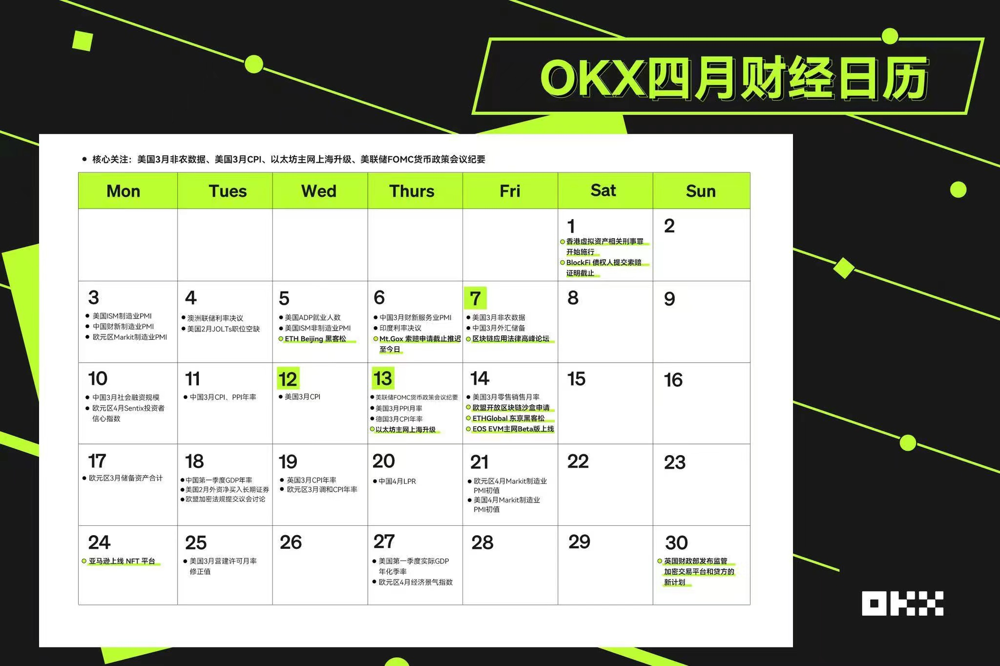

# 2023年4月

## 4月1日
消息面清淡

- Bittrex Inc.将于 4 月30 日关闭美国平台结束九年的运营
理由是当地监管和经济环境使其在该国运营“不再可行”。所有客户资金可在 4 月底前提取，其在美国以外的全球业务将继续运营
美国的法律越来越严了。

- 彭博社称孙宇晨正在出售 Huobi
孙宇晨已经就出售 Huobi 进行了谈判，孙宇晨在过去几周试探了潜在投资者的意见。孙宇晨向彭博社否认了这一消息。早先孙宇晨支付了约10亿美金从李林等手中购买了 Huobi 交易所。但此后孙宇晨营销为主的打法在火币上难以起到作用，目前24小时交易量已跌出前十。
- 4月日历。消息面清淡。
