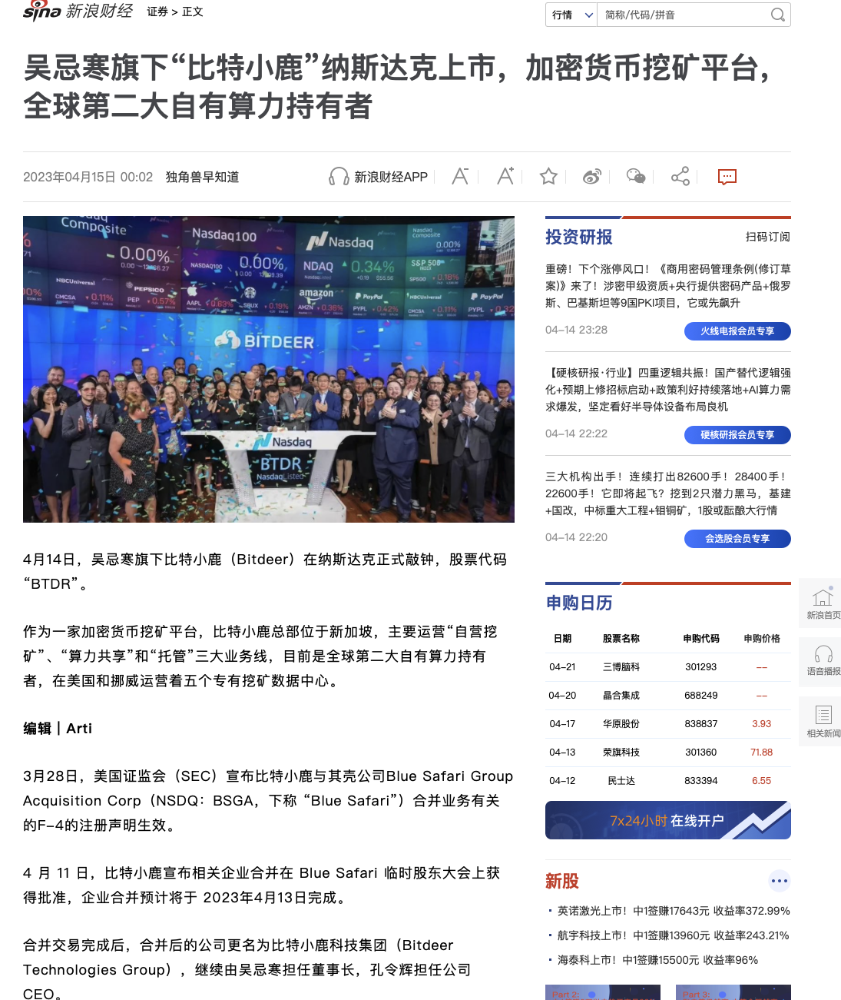
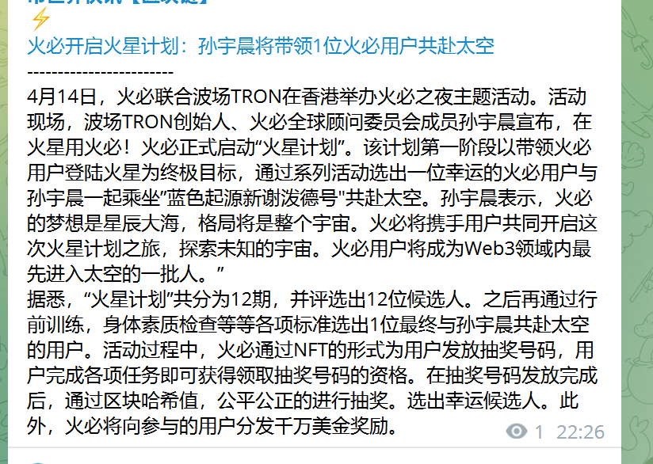
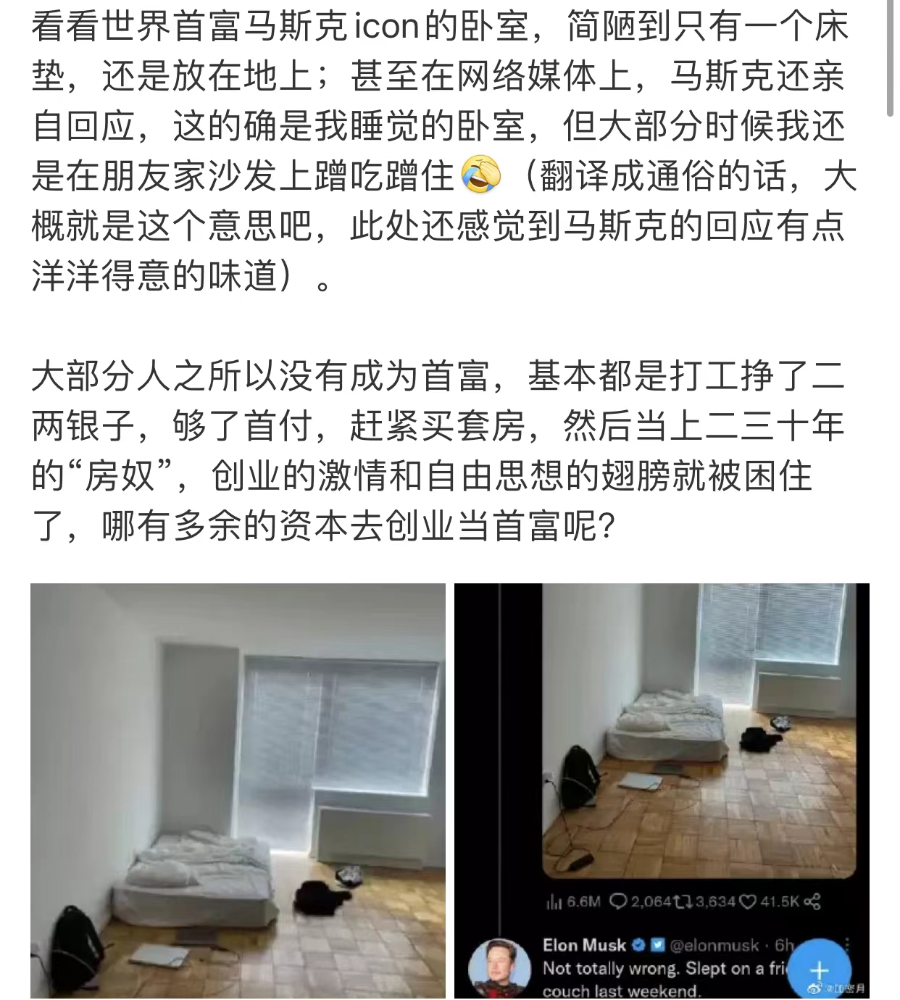
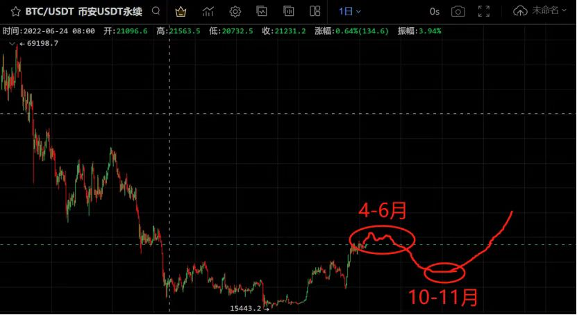
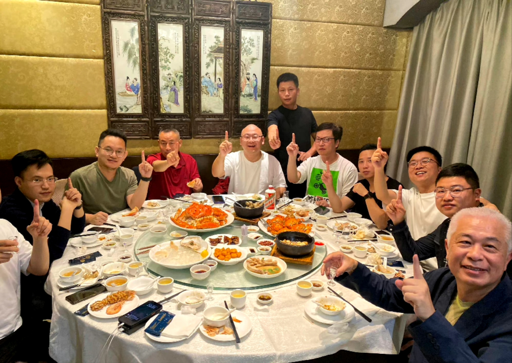
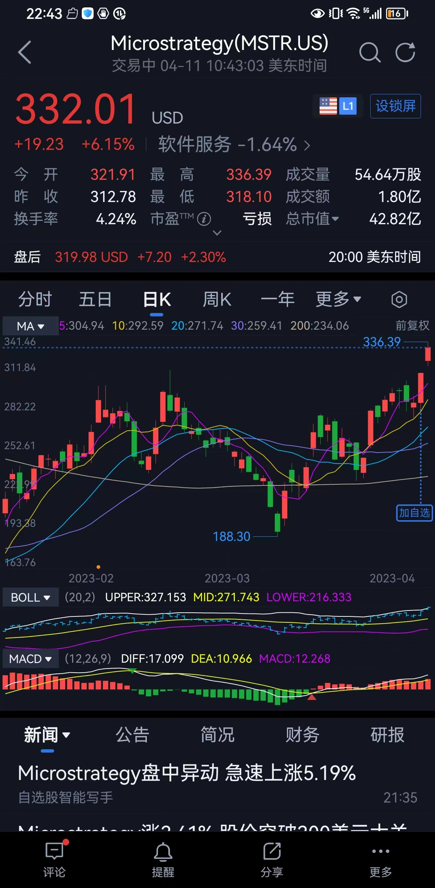
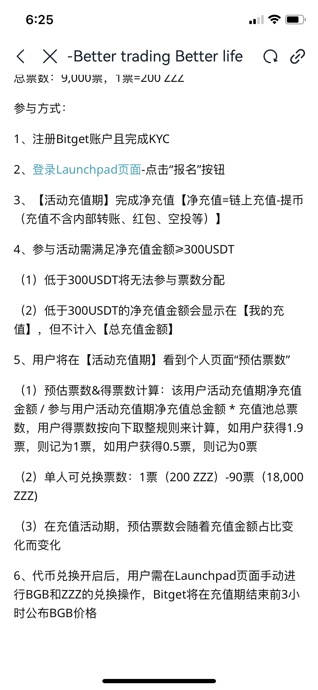
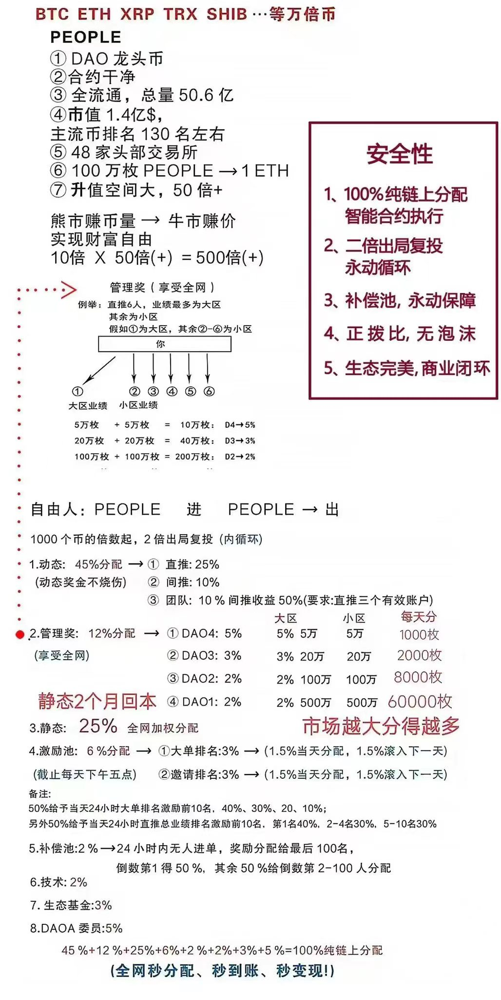

# 2023年4月

4月最大的事，就是香港Web3.0大会了。币价也因此从4月11日开始，上一个台阶。blur,arb,rndt大涨。okb挖矿sui。

## 4月30日

## 4月29日

## 4月28日

## 4月27日

## 4月26日

## 4月25日

## 4月24日

## 4月23日

## 4月22日

## 4月21日

## 4月20日

## 4月19日

## 4月18日

## 4月17日
夜里涨了一下，上午又下来了。

## 4月16日
上涨后横盘第二天。arb涨不动了 ，但blur和rndt还在涨。
晚上减产币LTC起飞，带动dash上涨。

- [硅谷银行倒闭原因再分析](https://mp.weixin.qq.com/s/lG01zN-LdzeJZcVJswynFQ)

## 4月15日
上涨后横盘第一天。新币大涨。香港概念cfx熄火。
- OKB挖矿SUI，一下子热起来。都在讨论。关于白名单销售，时间是2023.2.1前加入discord的用户，没戏了。

## 4月14日
早上8点多突然暴涨，ETH突破2100，BTC也接近31000，厉害。只是目前再也没有追高的冲动了。2月追高还挂载山顶。
2019年也是这个时候上涨。
- 吴忌寒，比特小鹿上市。
- 孙割去火星是认真的。
- 撸空投gas费，一般是是北京时间早7-9点，中午1点左右低一些。查看[地址](https://www.blocknative.com/gas-estimator?utm_campaign=Gas%20Platform&utm_source=share-extension)
- 马斯克的卧室。

## 4月13日
今天ETH突破2000美元，彻底摆脱之前1800的平台，也摆脱昨天拉升值1900+的价格。

- 以太坊完成上海升级 验证者提款启动。查看[抛压](https://token.unlocks.app/ethereum-shanghai)
以太坊权益证明链于今日 6: 30 成功升级为 Shapella，启用提款功能。截至 21: 10 已提款数量为 12.1 万枚 ETH，存款数量为 6.7 万枚 ETH，净提款数量为 5.4 万枚 ETH。当前存款数量 (2.7 万 ETH) 已逐渐超过提款数量(0.76万ETH)。
- （感觉有戏的样子，不知道Luna还有没有机会）FTX 已收回 73 亿美元的资产 考虑在7 月份重新开放交易所业务
FTX 已收回 73 亿美元的资产。包括 20 亿美元现金、43 亿美元 A 类加密货币、3 亿美元证券、6 亿美元投资应收账款等。FTX 正在考虑在 7 月份重新开放交易所业务。
- （已成明日黄花）Yearn Finance 疑似遭闪电贷攻击 损失超过千万美元
监测到的黑客三个地址显示其获利超过 1286 万美元。Paradigm 研究员samczsun 表示，Yearn Finance 的 USDT Tken (yUSDT) 疑似在 1,00(多天前部署时便被错误配置，错误地使用了 Fulcrum iuSDC 部署，而不是Fulcrum iUSDT.
- 大部分人都是如下图这样看的，跟小马看法一样。估计市场就不会这样走，市场就是反向的，直接拉爆，6月让大家上不了车。

## 4月12日
经过昨天一天的大涨，BTC/ETH开始横盘震荡。晚上BTC会到30000，ETH回到1900上方。

- 截止今天：至此 MicroStrategy 持有 140000 个比特币，平均购买价格为 29803 美元，约合 41.7 亿美元。[MicroStrategy 财务健康状况研究：会破产吗？什么时候需要卖币？比特币价格多少时盈亏平衡](https://mp.weixin.qq.com/s/j_iTeyDF022IeAEJdEJFww)
- 香港 SFC 要求 DeFi 项目需要持牌并受监管。吴说获悉，在美国推出 DeFi 风险报告后，香港证券及期货事务检查委员会中介机构部临时主管蔡钟辉在今天的 “2023 香港 Web3 嘉年华” 上表示，DeFi 项目需要受到 SFC 的监管，自动交易服务也是属于 SFC 监管之列，去中心交易所如果涉及到虚拟资产，也需要申请牌照；一些 DeFi 协议名义上是去中心化的，现实中少量开发方持有大量治理代币，需要分析其实质性而不是表面的说法。 
- 香港众安银行将通过持牌交易所提供加密货币到法定货币的兑换服务。
4月12日消息，香港众安银行 (ZA Bank) 首席执行官Ronald lu在周二接受采访时表示，香港众安银行将通过持牌交易所提供加密代币到法定货币的兑换服务。Ronaldlu表示，众安银行将作为客户的结算银行，允许他们在交易所存入加密代币后，以香港、中国和美国货币取款。
04-12 10:35
Ronald lu还表示，该商业模式已经与HashKey和OSL一起运作，这是香港目前仅有的两家获得许可的加密货币交易所。众安银行也将为获得许可的其他交易所提供相同的服务。 (彭博社)

## 4月11日
BTC大涨，突破3万大关。昨天晚上其实提前知道这个可能，但没有任何操作。错过错过。  
香港Web3.0会议开启（为期三天）
- 比特币价格突破3万美元创 2022年6月以来新高
24 小时涨幅达 6.7%。据 Coinglass，过去 24 小时全网爆仓 1.74 亿美元其中比特币爆仓金额达 1.08 亿美元。同时比特币创下了自 2021年 11 月以来最高的季度涨幅 (+70%)和月度涨幅 (+43%)。MicroStrategy 比特币持仓也时隔 10 个月重回浮盈状态。
- 香港成立 Web3.0 协会
香港行政长官李家超、北京中央驻港联络办公室领导将出席今日在香港交易所举行的 Web3.0 协会成立典礼，以显示北京中央及特区政府的支持。金融管理局前总裁陈德霖担任会长，财经事务及库务局前局长陈家强出任首席金融顾问。协会发起机构为中国移动、招商局、华为、香港科技大学。
- 首尔检方申请冻结 Do Kwon 资金
首尔南区检察官办公室表示，正在等待法院命令冻结 Do Kwon 在该国的约71 亿韩元 (530 万美元)资产。检察官表示，他们还在追查流入各种加密货PT不门工动心所得早节bnance以防止 Do Kwon 提取他据称保存在加密货币交易所中的任何加密资产。币安发言人表示对韩国当局提供了所要求的协助。
- 香港饭局。
- 美股中的加密货币概念股，纷纷大涨。

## 4月10日
仍然没有任何波动。
- bitget打新。

## 4月9日
币圈静默期，太安静了。
- 老师：和大家聊天中最大的感悟就是， 这几年很多人都赚过几千个，但是还是因为这样那样的等等投资过于激进，而让自己的资产损失较多。
    - 这其中就有一个案例，一个朋友去年因为公司盈利出现大幅缩水，所以就有些着急，因为想着这么多员工跟着自己，所以就不断的找项目，但是因为去年整体的大环境不是很好，所以接连投入的好几个项目，他们都是亏损状态。后来无奈之下，公司才开始裁员了。
    这个其实我也感触很深，当一个人很着急的时候，一些决策可能质量就不一定很高了。这让我想起我2017年年底从外地回到西安的时候，也是因为持续亏损，所以接连作出多个错误的决策，也是我人生中当时亏损较为严重的一年。
    从那之后，我就有一个小小的感触，我发现如果你在一年之内有超过3个较大决策失误的时候，你就要静下心来好好思考了，而不是还在持续进攻进攻。有可能是你的思维方式出问题了。这个时候可以见一些相对层级比自己高的人，多聊聊，可能会好一些。我自己是深有感触。
    身体的残疾自己一眼可以看见，但是思维的残疾和思想的残疾一定是已经走过了你的路的人才看的更清楚
    - 多去破圈，多找比自己更高一个维度的人聊天，你会发现认知常常被碾压。我很享受这种认知被碾压的感觉。如果有一段时间，我发现我周围的人都认为我是最厉害的时候，我就知道接下来没啥成长空间了，这个时候，我就开始启动我的链接牛人的程序了
- 老师：撸空投。
    - 这次长沙的几个朋友在这次撸空中获得不错的收获。从blur到arb都分别斩获了超过上百万的收益，但是发现他们都卖的价格好低😄
    - 大家在聊的过程中，一致认为的一个重要的关键就是**专注**。web3机会太多了，但是当你对机会只是停留在一个知道的层面的时候，你发现往往你可能只是停留在知道层面而已，而没有重视。这些朋友他们过去只做比特币挖矿和以太坊挖矿，在2021年很多人还各种奢望以太坊官方延长pow挖矿的时候，他们就已全部将以太坊矿机抛售。从2021年初到年底陆续全部出货。从去年大家都知道因为整体行情很差，所以这个时候他们开始在op之后就在撸空方面发力。其他的他们什么都没做，就只做撸空这一件事，而且他们就几个人纯手动撸，就在两个项目上分别斩获不错的收益。
    - 其实今年，社群的老朋友应该有较深的感受，我在社群比在过去分享的内容要少了一些。过去我们在社群分享的东西还是挺多挺杂，但是我认为有些机会可以去感受，但是不要花太多的时间。而在有些事情上就要多花一些时间，比如我在投研上，我就投入时间比较多。什么都想抓的人，往往最后可能什么都抓不上。找到你的方向和发力点，持续深耕发力。以上近期出差感悟，希望对你有所启发。
- 老师：从刻舟求剑的角度来看，这一轮上涨依然还没有结束。
    - 大饼和小币种上涨
    - 大饼吸血上涨
    - 以太带领小币种上涨
    目前（4.9）似乎处于从2到3过渡阶段。

    投资这件事，有些人心急火燎，有些人慢慢悠悠，找到你的节奏，策略一致性很重要。

    关于小币种，我的理念是，大多数情况下，能买上就买，买不上就等呗，一点点买，不着急。急啥？咱们有大饼和以太护体，怕啥呢？追小币种的情况较少（当然追的策略属于右侧，当然也没有问题，核心是你要策略一致性，出现相反情况你得赶紧撤）。

## 4月8日
一直萎靡不振
- people传销盘，我看不懂。

## 4月7日
萎靡不振
- Terra 罪涉案总额超3 亿美元
Terra 犯罪涉案总额为 3.14 亿美元，Do Kwon 涉案金额为 6900 万美元;Do Kwon 可能将很大一部分财产换成比特币，转移到海外交易所，检察官已要求币安阻止 Do Kwon 提取加密货币。（其实也没那么多钱，还得起）
- LooksRare 宣布上线 V2 版本
包括将协议费从 2% 降为 0.5%，Gas 费用比 Blur 便宜 50%，批量购买和上架，一次性可购买 70 多个 NET，卖家获得 ETH 而不是 WETH 等。
- 露露姐79年，孩子才12岁，要读香港大学，旁边买个房子。
要孩子好好努力，去考港大。我好好努力赚钱买在香港大学旁边，孩子读大学的时候可以每天回家住，多余的房间还可以租给同学。完美[呲牙]
反正25年我肯定会套现的，买二手没关系，新房太少。
因为香港收入高。所以需要娃去考港大，在香港工作，积累第一桶金，同时好好培养财商，之后利用钱生钱。在35岁之前一定要退休。这样，后半生可以做自己喜欢的事情了
- 露露：九妹啊，温老师推荐买arb，我就买了点，后来发现九妹买那么多（27万个）
arb最近那么大利空都没怎么跌，又是体验和生态最好的L2，前面持币大的流通地址一枚没卖过。庄家都不急的，这个价格出货不满意。

## 4月6日
萎靡不振
- 欧易关于部分现货币对下线的公告（时代总是一去不复返）
- gem是opensea用来和blur竞争的pro产品。 https://opensea.io/collection/gemesis/drop?tab=mint
    - 如果之前有用过 Gem 的，看看是否可以领这个空投，需要注意两个事情：
    - 1、总量是18万个，现在领了3万多个。
    - 2、看看价格和 Gas 费的差价再操作，NFT 价格看 https://opensea.io/collection/gemesis 现在 0.029 ETH，还有利润。
- MicroStrategy 再次购买 1045 枚 BTC 均价 28,016 美元 
4 月 5 日，MicroStrategy 宣布以 28,016 美元的均价再次购买 1045 枚 BTC，共计 2930 万美元。截至 4 月 4 日 MicroStrategy 持有 140,000 个比特币，平均购买价格为 29,803 美元，约合 41.7 亿美元。
- Twitter的logo又换回来。狗狗币又跌了。
- 苹果电脑藏BTC白皮书。
- 群里看好OKB，因为在走上坡路。格局提升：上币提前（比币安块），有问题赔的快，香港布局牌照，同时币安被整。另外通缩，生态不断完善。
- 保姆级出金教程。

## 4月5日
美股跌，币圈却涨，特别是ETH领涨。再过一周，ETH就变成可租资产了。
- OKX 发布 TRX交割合约下线的公告
OKX 表示，考虑到市场原因和用户需求，计划于近期逐步停止 TRX 币本位及U本位交割合约的生成，并于 2023 年9月30 日下午 4:00(UTC+8) 正式下线 TRX 交割合约。4 月 14 日 起不再生成次周交割合约; 6 月 16 日起不再生成次季交割合约:已经上线交易的合约不受影响可正常交易
- 迪拜虚拟资产监管局官员要求币安提供更多信息
迪拜虚拟资产监管局(VARA)的官员最近几周要求币安提供更多关于其所有权结构、治理和审计程序的信息:VARA 要求所有寻求许可的国际公司提供类似信息。VARA 官员还在 Binance 全球集团层面寻求有关所有权、审计和董事会程序的信息。
- Gem 更名为 OpenSea Pro 并发放 Gemesis NFT 空投
OpenSea 宣布旗下 NFT 聚合市场 Gem 更名为 OpenSea Pro，在 2023 年3 月 31 日之前于 Gem 上购买过 NFT 的合格用户将能够在 2023 年 5 月4日之前免费领取 Gemesis NFT，共供应量 18 万枚，目前已铸造 6.7 万枚,当前地板价为 0.051 ETH。但 Gemesis NFT Mint 参数配置存在问题，致使Mint 总量一度仅为 655,35，目前该问题已修复。
- 这种偏僻空投，还是要多注意，很容易被钓鱼。一般我怎么评判某个粉丝多的账号值不值得信赖，我会看我关注的大v里有几个关注了他，如果都没人关注，那就要注意了，不值得信赖。不能光看粉丝多
- 昨天的Arbitrum基金会事件
这个事件简单的说就是项目方基金会在未经过投票通过（正常治理）的情况下转移了代币，转移了7.5亿枚代币，其中有5000万枚代币被发现转入了交易所。虽然项目方回应社区说这部分代币不是套现的，是转给做市商的。但是就转移的这个动作已经在社区引起了强烈不满。
这相当于给到社区的印象是，你所谓的治理其实就是虚的摆设。代币也没有通过代码进行锁定，那么社区就想如果是这样的话，你这些币想卖就卖，想抛就抛了？
这的确是给大家一个非常不好的印象，本来是Layer2中的王者，瞬间跌落神坛。
我认为，通过这次事件引发的社区和基金会之间的冲突，基金会吸取这个教训。上一个不重视社区的项目还是Opensea，虽然是龙头，但是当Opensea传言要到传统股市上市的时候，引来了大批的社区不满和谩骂。
我们也持续关注。总体来说，我认为问题应该不大，孰轻孰重，基金会会掂量，即便当前是Layer2中的老大。但是如果真让社区不爽（生态），其他的Layer2链也不是不能选择（我自己有持有$arb）。
- 香港让我感觉到这个时代真的来了，不要再犹豫质疑。 
  
- 三年疫情，经济危机，让很多中产崩盘。

## 4月4日
消息面清淡，美股涨也不跟
- [Messari：六大EVM生态盘点，究竟谁能杀出重围？](https://www.theblockbeats.info/news/36081)
- 比特币挖矿超过50%的电力来自可再生能源
4月3日，据ESG分析师和投资者DANIELBATTEN的研究，比特币挖矿中使用的大部分电力是来自可再生能源。水电占采矿业使用的所有能源的23.12%。此外，风能、核能和太阳能分别占挖矿所有电力的13.98%、7.94%和4.98%
- 太火热了——部分用户在 zkSvnc Era 上无法进行存款并存在转移存款困难的问
目前团队正在进行修复，预计 24 小时内部署解决方案。此前 zkSync 因区块队列的数据库出现故障，导致区块生产停止，在 4 月1日岩机 3 小时左右。
- 部分用户的推特图标由蓝鸟标志变为 DOGE coin LOGO
马斯克发布了 meme 推文，受此影响 DOGE 涨至 0.098 美元，24 小时涨幅达 26%。据 Lookonchain监测，DOGE 第五大持仓地址
(DDuXGMFNGpGiaAqyDunSMvceMBruc1wwKF ) 在 DOGE 价格上涨后转出 6.5 亿枚 DOGE (约 6130 万美元) ，目前余额 37.86 亿枚 (约合3.7 亿美元)。
- Do Kwon 曾在逃跑期间拒绝美国的司法管辖权
有观点认为 Do Kwon 拒绝美国当局的管辖权可能是出于降低未来惩罚力度的考虑。目前美国采用单个罪行量刑相加的刑法体系，最高刑期可达100 多年，且 SEC 和当地检察机关已经预先作出了虚拟资产具有证券性的判断，而韩国最高刑期仅约 40 年，而且由于没有能够判断虚拟货币是否为证券的标准和法律，因此情况与美国不同。

## 4月3日
消息面清淡，美股涨也不跟
- 割韭菜无疑——arbitrum 基金会回应在上市当天向币安转移 ARB
Arbitrum 官方推特表示，关于 5000 万 ARB 代币的链上转移，4000 万ARB 已作为贷款分配给金融市场领域的参与者(做市商);剩余的 1000 万已转换为法定货币并专用于运营成本，出售是因基金会是在没有资金的情况下建立的，近期没有继续出售代币的打算。此外，基金会表示，将遵循 DAO的建议并将 AIP 拆分为多个部分，允许社区对不同部分进行讨论与投票，将在本周初提出新的 AIP 并参与 DAO 的公开讨论。
- 2024年12月1日前，BTC不到15万美元，就裸奔。

## 4月2日
消息面清淡
- 互联网上98%的人不输出。

## 4月1日
消息面清淡

- Bittrex Inc.将于 4 月30 日关闭美国平台结束九年的运营
理由是当地监管和经济环境使其在该国运营“不再可行”。所有客户资金可在 4 月底前提取，其在美国以外的全球业务将继续运营
美国的法律越来越严了。

- 彭博社称孙宇晨正在出售 Huobi
孙宇晨已经就出售 Huobi 进行了谈判，孙宇晨在过去几周试探了潜在投资者的意见。孙宇晨向彭博社否认了这一消息。早先孙宇晨支付了约10亿美金从李林等手中购买了 Huobi 交易所。但此后孙宇晨营销为主的打法在火币上难以起到作用，目前24小时交易量已跌出前十。
- 4月日历。整个4月消息面清淡。
