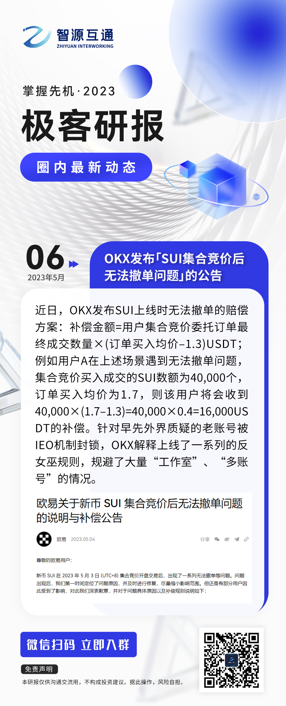
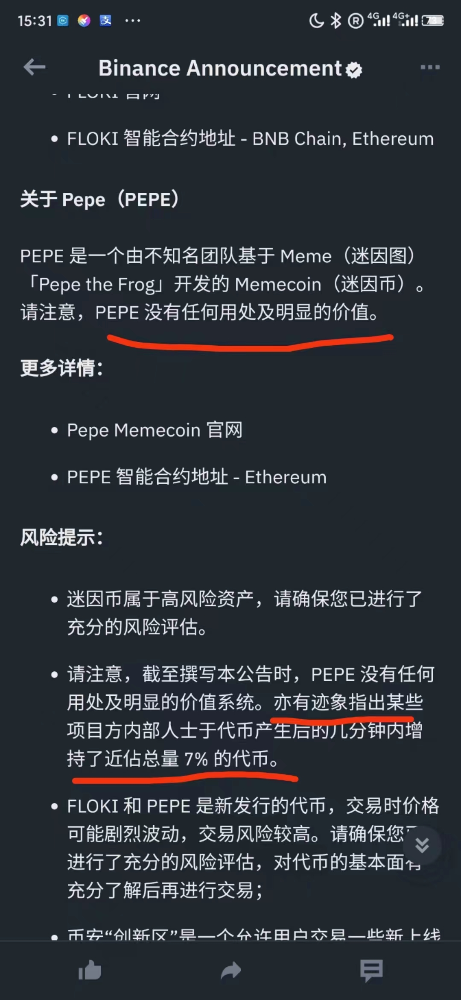
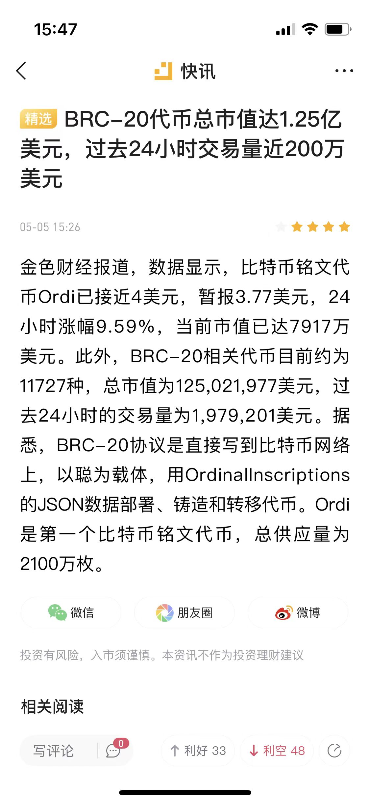
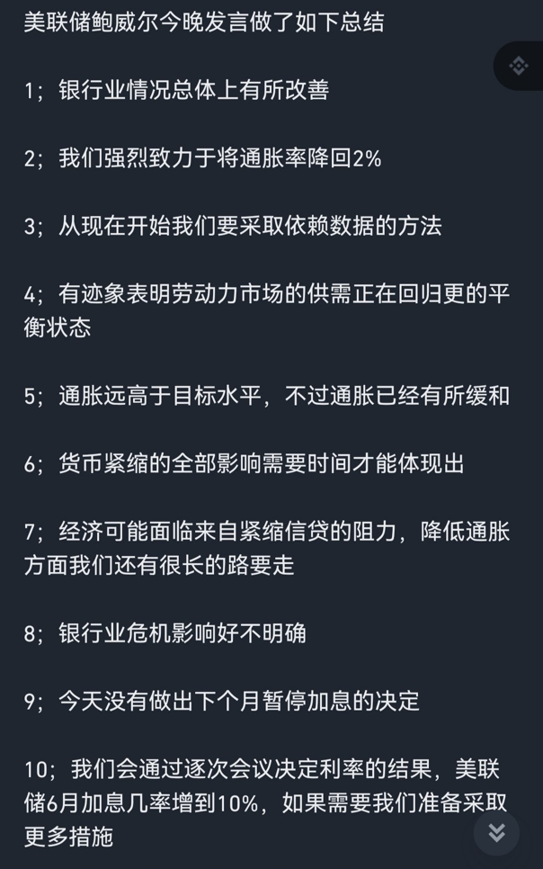
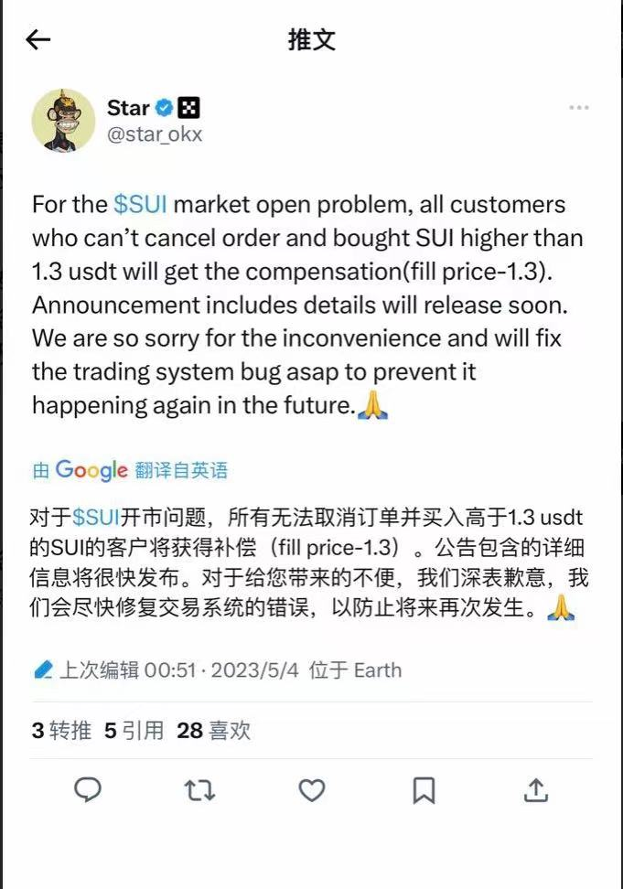
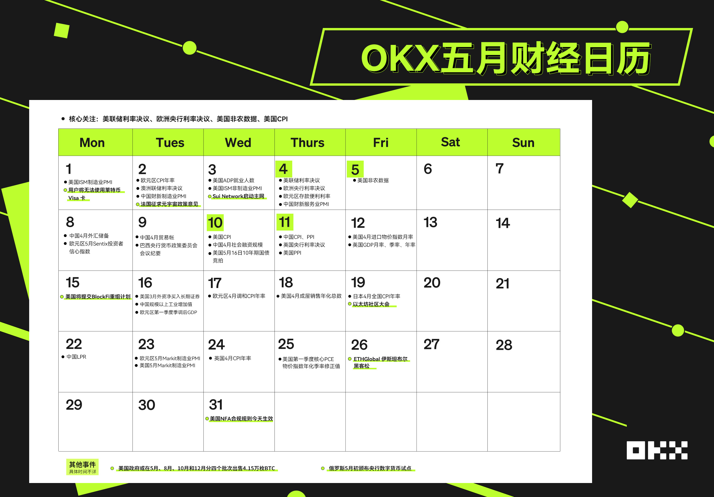

# 2023年5月

- 加息25个基点至5%-5.25%；非农好于预期；

## 5月6日
高位震荡。
- ok对sui的补偿方案。

## 5月5日
晚上非农数据好于预期，快速拉升一波，并稳在高位。pepe最靓的仔。
- pepe，上币安，再次成为最火的币。超越AIDOG。
- brc20继续火。币老师，说用女儿的名字发了，问有没有那个庄家操盘爆拉一下。

## 5月4日
- 上午2:00[美联储宣布加息 25个基点符合市场预期]
财联社5月4日电，美联储宣布加息 25个基点，将联邦基金利率目标区间上调至5%~5.25%，符合市场预期。这已经是美联储自去年 3月以来连续第 10 次加息，累计加息幅度达500个基点。
- OK又补偿。

## 5月3日
山寨真惨，还是大饼二饼硬啊。山寨一波跌回了2月的价格
- sui 20:00正式上线。
- [Sui World：Sui 主网将上线，你关心的问题都在这里](https://news.marsbit.cc/20230503091717668183.html)
- brc大火

## 5月2日
消息面清淡
- [万字雄文解读 Bitcoin Ordinals](https://www.chaincatcher.com/article/2089765)
- 莱特币社区成员通过效仿 BRC-20 标准提出 LTC-20 试验标准
并已在 LTC ordinals 上进行了测试项目“lite”。据 BRC-20 io 数据，当前BTC Ordinals 上已有 8046 个 BRC-20 Tokens 发行，市值达 1.33 亿美元，过去 24 小时交易量为 90.4 万美元
- Coinbase 推出国际交易所 上架 BTC和 ETH 永续期货合约
Coinbase 正式推出 Coinbase International 交易所，已上架 BTC 和 ETH永续期货合约，所有交易均以 USDC 结算，最初提供高达 5 倍的杠杆，符合条件的非美国司法管辖区的机构客户可以通过 API 进行直接访问交易，产品目前不适用于零售客户。

## 5月1日
凌晨再次天地针。然后大幅下跌。

- 孙宇晨处参与币安 Sui 挖矿引争议 CZ 称属实将采取行动
孙宇晨于今日中午向币安转入 5900 万枚 TUSD，孙宇晨回应称该举只是为了提供流动性非参加交易所活动。CZ 表示，如果孙宇晨使用 TUSD 抢购_aunchPool Sui 代币，将对其采取行动。随后孙再次发推称，经查确有后事利用部分该资金参与交易所活动，会对此进行退款。

- Sui 主网将于本周三北京时间 20 点正式启动
据 Sui 官方推特，主网将于本周三北京时间 20 点正式启动
- 五月日历

