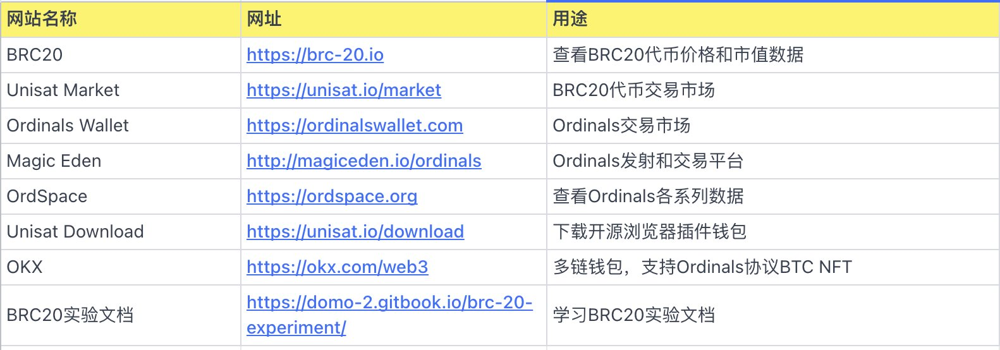
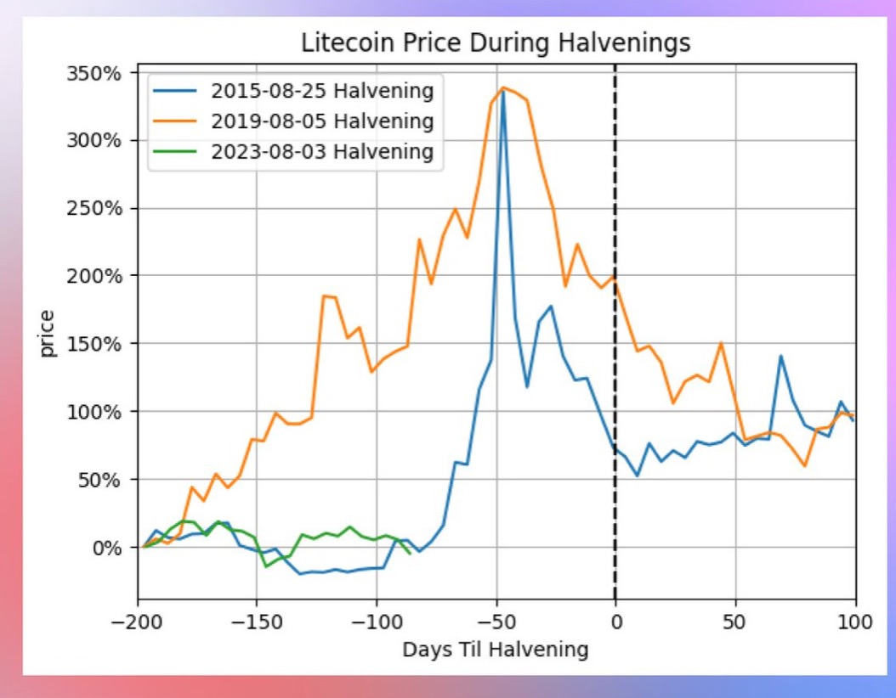
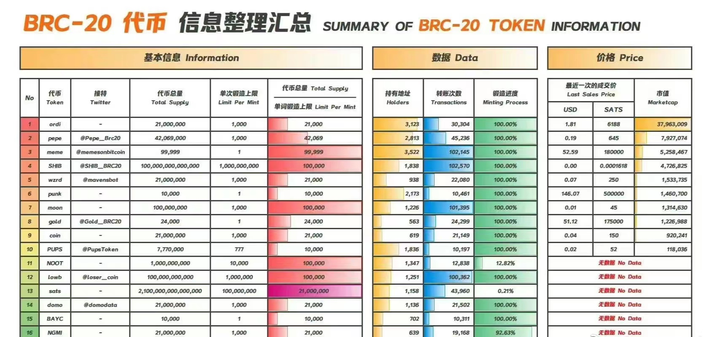
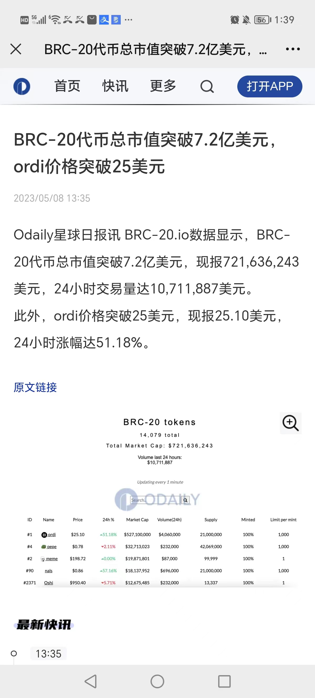
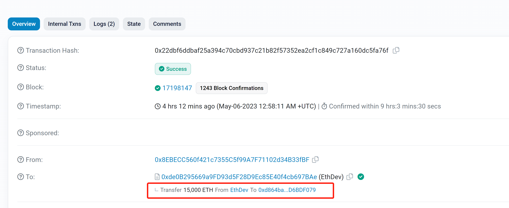
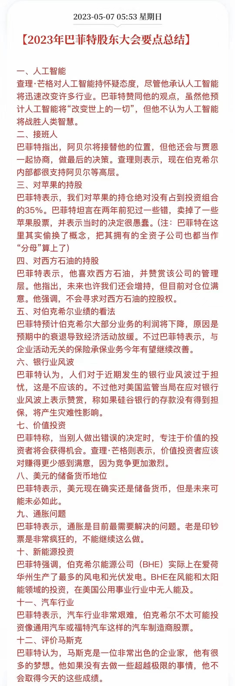

# 2023年5月

- 5.4 凌晨两点：加息25个基点至5%-5.25%；非农好于预期；
- 5.9 马斯克等美国经济崩溃言论：12-18个月不要投资。（市场下跌也回应此说法）
- 5.10 晚上20:30，4月未季调CPI年率4.9%，创两年新低。利好，夜里却出现天地针。
- 5.14 美债6月1日前，存在风险。回头看也成为下跌主因。

## 5月15日
持续低迷，后来开始上涨。
- brc20站点。
- KuCoin 矿池宣布推出 LTC 挖矿服务，离 LTC 减半余 79 天
KuCoin 矿池宣布推出 LTC 挖矿服务，将于 2023 年 5 月 16 日10:00:00(UTC)开始支持 LTC 挖矿，同时支持 DOGE 的联合挖矿。目前距离 LTC2023年8月3日减产还有 79 天。
- OKX 交易所 APP 首页主流币已删除 OKT
此前主流币列表为 BTC ETH OKB OKTLTC DOGE MATIC SOL。目前已没有 OKT。早先徐明星表示，OKB Chain 将是以太坊的 L2 链，从侧链技术开始，向 ZK 技术发展。OKT 链将继续是 L1链。

## 5月14日
本轮下跌主要原因是债务危机。
- LTC减半行情受关注。
- OKX 创始人徐明星表示已上线 BRC-20 浏览器。早先徐明星表示，将与 UniSat Wallet 致力于为 BRC-20 和 ORC-20 构建基础设施，包括钱包、市场、流动性兑换和浏览器。目前为止还没有计划在 OKX 上线这些代币，上线决定取决于技术、流动性和社区的发展。
- 据 @BigCryptoAlert 监测，币安 CEO CZ（赵长鹏） 已于推特上取消了对马斯克的关注。早先币安投入 5 亿美元以支持马斯克对推特的收购计划。

## 5月13日
筑底。
- 比特币与以太坊相关性 18 个月来首次跌破 80%。**ETH更弱一些**
比特币和以太坊的滚动 30 天相关性本周降至约 78%，为 18 个月来首次下降至 80% 以下。相关性衡量了两种资产价格的紧密程度。当相关性较低时，意味着它们的价格更频繁地朝不同方向移动。上个月，Coinbase 称比特币在美国银行业动荡和对非比特币加密货币加强监管审查的背景下表现优干其他加密货币。
- Layerzero 日交易笔数达 26.5 万笔，创历史新高
这或与近日 Layerzero 官推暗示 5 月即将有令人兴奋的公告发布有关。@superamscom 数据面板显示，当前 Layerzero 已有超过 142 万个地址与之交互，其中近 80% 的地址独立活跃日数小于 5 天，50% 的地址独立活跃周为 1周，61.5% 的地址独立活跃月为 1个月。

## 5月12日
人气低迷，成交量低下，第四天再下一个大台阶。
- Do Kwon 将在支付 43.6 万美元保释金后被释放
Do Kwon 向法庭说明了自己的经济状况，表示自己拥有价值数百万的财产具体数额将由妻子支付。并承诺，如获保释，他们将在刑事诉讼结束之前不会躲藏，定期回应法庭传票，并将在辩护律师提供的地址与他们联系。
- 这几天大跌原因：
1、以PEPE和ORDI为首的MEME币吸血了$30亿资金
2、美国要找加密投资者和矿场征税，吓走了大户 
3、美国债务上限要到顶，目前拜登与共和党原定于周五的谈判推迟  
链上数据，昨晚到今天的链上数据显示   
凌晨1点流入3000多BTC，稳定币还是流出状态  
5月偏空，等美债危机解除，避险资金继续回归，香港开放入金，行情才会回暖

## 5月11日
夜里再次出现天地针，没想到，最近的上涨都是假的。理由竟然是tether被监管。
人气低迷好几天了。
- **流动性枯竭是底部的体现啊。** ETH 短期 IV跌幅明显目前已经全期限创出历史新低
  由于宏观数据未能带来市场波动，主要期限隐含波动率今天出现大幅下跌特别是 ETH 短期 V 跌幅明显，目前已经全期限创出历史新低。目前 BTC 和ETH 的 VRP 都已跌至 -9%，低迷的波动率和极高的波动率风险负溢价代表机构严重看衰未来的波动，同时也表明市场的流动性正在减弱。
- **感觉是一个美国债务违约信号。** Circle 将不再持有 6 月初以后到期的美国国债 以避免陷入潜在的美国债务违约
  Circle 首席执行官 Jeremy Allaire 在接受 Politico 采访时表示，该公司调整了支持其 USDC 的储备组合，以支持短期美国国债，不再持有 6 月初以后到期的美国国债，从而避免陷入潜在的美国债务违约。
- **孙割，行业冥灯来了。** 我已经决定开始通过我的公开地址积极交易Meme币和有前途的项目。请注意，我个人将承担这些交易的所有潜在损失，所得利润将全部捐给慈善机构。然而，重要的是要记住，我的投资不构成财务建议，也不保证这些项目在任何交易所上市，包括 @HuobiGlobal 和 @Poloniex 。我只是为了好玩而交易代币，大家投资前一定要自己做好研究！

## 5月10日
终于在三天三次大瀑布后止跌。最后一天最难受，如果那时割肉将是最痛苦的。
- 4月未季调CPI年率4.9%，创两年新低
5月10日消息，据金十报道，美国4月未季调CPI年率4.9%，预期5.0%，前值5.0%。
- sui平台首个募资代币，太火爆，我放弃了。https://app.cetus.zone/launchpad-detail/0x8b3b1b25d0769ec4165c9d7cf6090375be6066c3b4b35cb472c7eb8f05b07a9c

## 5月9日
第三次大瀑布。
- 币安宣布其 NFT 市场将于 5 月下旬支持比特币 NFT 协议Ordinals（跟进真及时，佩服）
  币安宣布其 NFT 市场将于 5 月下旬支持比特币 NFT 协议 Ordinals，用户可直接从币安账户购买和交易比特币 NFT，无需使用单独的比特币钱包。币安NFT 还将对比特币 NFT 创作者提供版税支持。
- 今年在币圈赚100W的方式
  `
  看你们玩这些赚这么快，好焦虑啊
  今年在币圈赚100W的方式
  3月初 ORDI 成本3U打一张 花费60U 拿到今天价值20WU
  4月初 买入100U aidoge 现在价值100W+
  4月中 买入100u PEPE 现在价值100W+
  4月中 MINT shibai NFT 成本1U一个号 100个号成本100U 100个号价值100W
  三天前 买入2000U pogai 现在价值20WU
  `

## 5月8日
第二次大瀑布。
- 财富自由标准。
- BRC-20代币汇总。
- BRC-20代币总市值突破7.2亿美元ordi价格突破25美元。

## 5月7日（周日）
- 这是继以太坊基金会上一轮牛市以后的较大金额卖出行为，值得我们警惕。上一次以太坊基金会卖出20000个以太坊还是在2021年的10月份。
  
- 2023年巴菲特股东大会要点总结 

## 5月6日
高位震荡，下午又跌回起点。
- 币安因涉嫌违反对俄罗斯的制裁遭美国调查
  美国司法部正在调查币安是否被非法用来让俄罗斯人逃避美国制裁并通过币安转移资金。司法部国家安全部门正调查币安或公司管理人员是否违反了对俄制裁措施。据知情人士透露，币安一直在与司法部进行讨论，以解决此前关于该交易所在强力合规规定出台前被用来规避对伊朗制裁的指控。币安在声明中表示，其完全遵守所有美国和国际金融制裁。
- ok对sui的补偿方案。

## 5月5日
晚上非农数据好于预期，快速拉升一波，并稳在高位。pepe最靓的仔。
- 美国4月季调后非农就业人口录得增加25.3万人，为今年以来最小增幅
  美国4月季调后非农就业人口录得增加25.3万人，为2022年12月以来最小增幅，美国4月失业率录得3.4%，为今年1月以来新低，低于预期的3.6%与上个月的3.5%。
- pepe，上币安，再次成为最火的币。超越AIDOG。
- brc20继续火。币老师，说用女儿的名字发了，问有没有那个庄家操盘爆拉一下。

## 5月4日
凌晨大幅震荡。后来白天上涨又下来。
- 美联储如期加息 25 bps
声明删除了上一次 FOMC 中“预计一些额外的政策收紧可能是合适的”的表述。鲍威尔表示，展望未来，我们将根据数据确定进一步收紧政策的合适程度。本周美国还将公布 4 月的失业率。CME 显示6 月14 日下一次 FOMC加息 25 bps 概率为 68%，停止加息概率为 31%
- 上午2:00[美联储宣布加息 25个基点符合市场预期]
财联社5月4日电，美联储宣布加息 25个基点，将联邦基金利率目标区间上调至5%~5.25%，符合市场预期。这已经是美联储自去年 3月以来连续第 10 次加息，累计加息幅度达500个基点。
- OK又补偿。

## 5月3日
山寨真惨，还是大饼二饼硬啊。山寨一波跌回了2月的价格
- sui 20:00正式上线。
- [Sui World：Sui 主网将上线，你关心的问题都在这里](https://news.marsbit.cc/20230503091717668183.html)
- brc大火

## 5月2日
消息面清淡
- [万字雄文解读 Bitcoin Ordinals](https://www.chaincatcher.com/article/2089765)
- 莱特币社区成员通过效仿 BRC-20 标准提出 LTC-20 试验标准
并已在 LTC ordinals 上进行了测试项目“lite”。据 BRC-20 io 数据，当前BTC Ordinals 上已有 8046 个 BRC-20 Tokens 发行，市值达 1.33 亿美元，过去 24 小时交易量为 90.4 万美元
- Coinbase 推出国际交易所 上架 BTC和 ETH 永续期货合约
Coinbase 正式推出 Coinbase International 交易所，已上架 BTC 和 ETH永续期货合约，所有交易均以 USDC 结算，最初提供高达 5 倍的杠杆，符合条件的非美国司法管辖区的机构客户可以通过 API 进行直接访问交易，产品目前不适用于零售客户。

## 5月1日
凌晨再次天地针。然后大幅下跌。

- 孙宇晨处参与币安 Sui 挖矿引争议 CZ 称属实将采取行动
孙宇晨于今日中午向币安转入 5900 万枚 TUSD，孙宇晨回应称该举只是为了提供流动性非参加交易所活动。CZ 表示，如果孙宇晨使用 TUSD 抢购_aunchPool Sui 代币，将对其采取行动。随后孙再次发推称，经查确有后事利用部分该资金参与交易所活动，会对此进行退款。

- Sui 主网将于本周三北京时间 20 点正式启动
据 Sui 官方推特，主网将于本周三北京时间 20 点正式启动
- 五月日历

