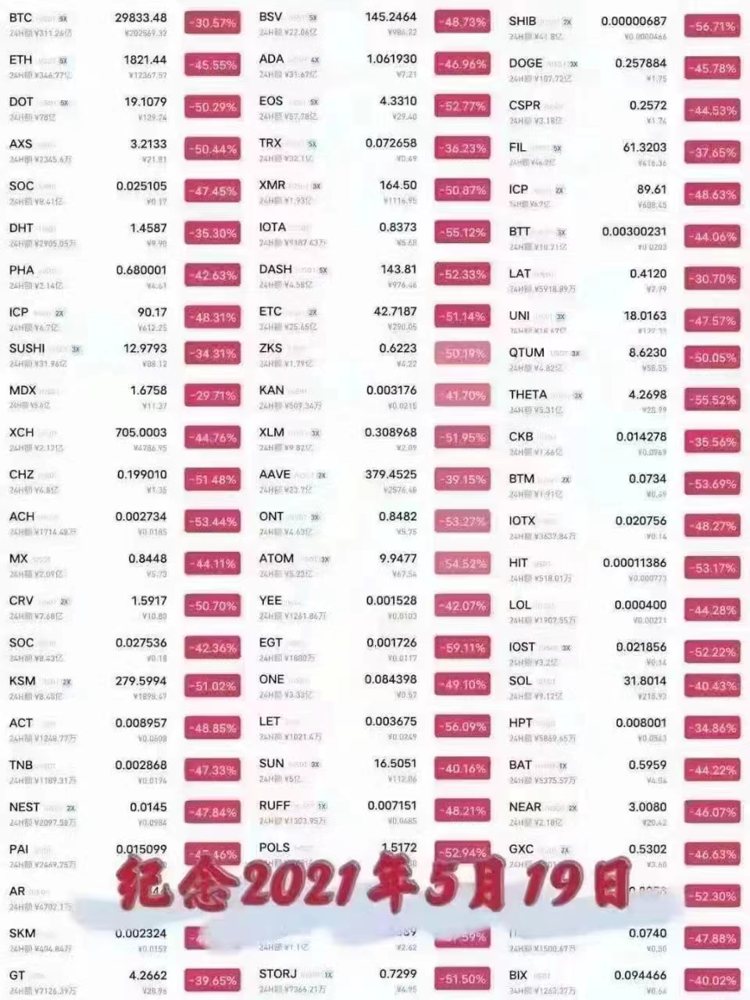

# 2023年5月

- 5.4 凌晨两点：加息25个基点至5%-5.25%；非农好于预期；
- 5.9 马斯克等美国经济崩溃言论：12-18个月不要投资。（市场下跌也回应此说法）
- 5.10 晚上20:30，4月未季调CPI年率4.9%，创两年新低。利好，夜里却出现天地针。
- 5.14 美债6月1日前，存在风险。回头看也成为下跌主因。
- 5.23 香港政策正式出台。
- 强大的ChatGPT： https://c.aalib.net/tool/chatgpt/

## 5月31日
- 数据分析产品 Nansen 宣布裁员 30%。2021年 Nansen 宣布获得 7500 万美元的融资，a16z 与 Tiger 领投。
- Sui 基金会宣布，首届官方Sui 黑客松从今天开始接受报名，截止日期为 7 月 5 日。此次黑客松为 Sui 基金会与 KuCoin Labs 共同举办，将于7月19日在巴黎 Builder House 和在线上举办 Demo Day。可参与此次黑客松的项目类别为：基础设施和工具；NFT、社交和DAO；游戏和AIGC；DeFi与支付。

- 吴说独家获悉，据多位消息人士对吴说证实，币安已启动裁员，目前比例尚不确定。币安总人数约为 8000 人，赔偿方案将根据各地不同情况制定。市场传闻6月裁员比例约为20%，截止发稿为止币安对此尚未回应。不过吴说也了解到少数部门仍在继续招聘。
此次裁员可能与整体行情不佳以及此前币安人数扩张较大有关。
- Dune 和 Nansen 其实有点像平台生态打法和付费产品打法。很明显前者的护城河更深，创作者、用户量、社区在熊市也依然非常活跃，基本没看到竞品对它进行什么挑战。Nansen 虽然有一定营收，但竞品（比如 Arkham 等等）很容易就蚕食它的蛋糕。说实话在没有知识产权保护的非技术领域，做付费产品很难。
有个小类比，英伟达最厉害的地方就是有一整套生态护城河，导致后来者几乎没有办法挑战它或者成本极高；靠纯产品取胜就是类似比特币矿机，比特大陆最后是靠技术与资本建立护城河，但却阻止不了神马成为它势均力敌的对手。

## 5月30日
- 白宫对比特币挖矿征收高额税款计划已天折
该税收计划最初由白宫于 5 月初提出，呼吁从 2024 年开始对比特币和其他加密货币挖矿所使用的电力征收 10% 的税款，到 2026 年将提高至 30%。俄亥俄州的共和党众议员 Warren Davidson 在周日表示，挖矿税不会生效。
- Ordinals Market 和 Bitcoin Miladys 联合发布 BRC-721E 标准
允许将不可变的、可验证的 ERC-721 NFT 迁移至 Ordinals。在桥接 NFT会将 NET 的数据编码到-个销毁本易由 在此期间会指定一田工接收nscription 的比特币地址，这也意味着销毁交易本身起到了链上Inscription请求作用。该标准的其他特征还包括费用成本低(可以使用仅 100 字节的JSON 进行铸造)、通过索引器可以完整地呈现元数据、具备未来升级和附加链上数据的能力。

## 5月29日
早上醒来，第二轮大涨。
- 用飞机比喻没上车的。
- BKEX 交易所配合警方调查暂停提币
BKEX 交易所公告称，平台部分用户资金涉及到洗钱，BKEX 目前正在配合警方取证，对此将暂停提现、配合工作。 BKEX 创始人为纪佳铭，2018年6月成立 BKEX，获得黄天威、节点资本、了得资本、FBG、BICAAlphaCoin Fund、浅滩资本、BlockArk、托马斯资本等机构的战略投资
- OKX 发布第七次储备证明: 公示币种增至 22个，总计价值达100亿美元
** 用户BTC 资产沉淀较上次 (4-22) 降低 4.1%; 减少 5264 枚 BTC，用户ETH 资产沉淀降低 12.3%，减少15.7 万枚 ETH; 用户 USDT 资产沉淀增长4.3%，增加 1.85 亿枚 USDT **

## 5月28日
公布债务达成和解，大涨。
-   

- [Curve CEO斥资4100万美元在墨尔本购买了一处新豪宅](https://www.panewslab.com/zh/articledetails/uec339r6.html)

## 5月27日
横盘，纹丝不动
- Bitcoin Core 25.0 发布，包括新功能、各种错误修复和性能改进
内存池和中继策略现在允许非见证大小为 65 字节及以上的交易。这是为了更好地反映针对 CVE-2017-12842 的实际提供保护，并开辟更小交易规模的其他用例。scanblocks RPC 通过扫描给定范围内的所有块过滤器，实现快速钱包重新扫描。
- Sei 允许用户通过 Humanode 人脸识别验证身份真实性
Sei 称，Verified Seilor 是用户的真实性徽章，证明用户是互联网中的真人而非机器人。Sei 还表示，为保证社区由真人组成，其 Discord 正在使用Crypto Bio 身份验证工具 BotBasher。此前 Layer1 公链 Sei 以8 亿美元的估值筹集了 3000 万美元，Jump Capital、Multicoin Capital 等参投

## 5月26日
上涨第二天
- Stably 宣布在 Bitcoin 上推出首个 BRC-20 稳定币 #USD
USD 采取完全抵押并可按1比1兑换由 Prime Trust 在 FDIC 保险的银行持Az28,727,192。目前 Stably USD 通过 USDC USDT 的最低买卖金额为 1,000美元，通过 Fedwire SWIFT 的最低买卖金额为 25,000 美元。

## 5月25日
暴跌，okb拉盘，因为香港利好消息。
- OKX 给香港散户投资者列出 16 种代币
OKX 宣布最新的 APP 程序将允许香港用户购买、出售和持有16 种主要加密货币，可使用港元、P2P 或通过第三方提供商的 ApplePay、Visa 和万事卡购买。需要注意的是 OKX 目前并未取得牌照，香港 SFC 给已运营的交易所主体提供了一年的过渡期，上述代币应是 OKX 根据香港 SFC 要求自行列出，后续会根据监管要求陆续调整。
- https://c.aalib.net/tool/chatgpt/
- 黑山高等法院推翻了此前允许对 Do Kwon 保释的判决，目前 DoKwon 仍在狱中
该决定也适用于担任 Kwon 前首席财务官的 Han Chong-ioon。此前二人获得了波德戈里察初级法院的批准，以 40 万欧元的的保释金获释，但检方随即提出上诉。
- 跑路。Multichain 表示部分跨链路由因不可抗力无法使用
恢复服务时间未知。服务恢复后，待处理的交易将自动入账。Multichain 联合创始人 Alfred Xu 在 Telegram 社区中针对创始人被警方逮捕一事表示:“团队正常工作”。币安发布公告称，在等待 Multichain 团队的明确说明期间，将暂停 POLS-BSC、ACH-BSC 等桥接代币网络的存款，资产在其他网络的存款仍然开放。

## 5月23日
上午突然大涨，受香港政策利好影响。
- 香港政策。
- OKX 将在巴黎建立其欧洲总部
OKX 已在法国申请监管批准，将在巴黎建立其在欧洲总部。OKX 于 4 月份在法国进行注册，计划在接下来的六个月内在法国招聘约 10 人，在未来三年内在法国达到约 100 名员工。巴黎与迪拜也是币安的双总部。
- 路透社: Binance 混合客户资金和公司收入，Binance: 报道缺乏证据
Binance 在 2020 年和 2021 年混合了客户资金和公司收入，违反了要求将客户资金与公司资金分开的美国金融规定。Binance 回应称，这篇报道非常薄弱，“路透社未找到币安客户资金丢失或被拿走的证据“。
- 香港证监会蔡钟辉:散户最快在今年下半年能进行虚拟资产交易
可于获发牌的交易平台进行买卖。若本地虚拟资产平台并非在条例实施前已经运作，或者海外平台在指引实施后仍没有牌照，都不能在香港进行虚拟资产交易业务，亦不能在港宣传推广，否则需负上刑事责任，而现正营运的平台可于条例指引生效后9个月内申请牌照。获发牌的平台亦需确保其客户有没有透过[翻墙]进行交易，并确保IP地址是否来自不能买卖虚拟资产的地区，强调需要遵守相关地区的规定。

## 5月22日
- 明天香港概念会开始炒作，明天就是最后一轮香港概念爆发的导火索，这个新闻比上次香港开会要大。
6月关注香港板块，看这波消息面的影响能不能带动萎靡不振的大盘强势起飞，CFX（板块龙头）、ACH（支付、香港概念、跟泡菜国还有关系）、MASK、KEY已经开始炒作起来了！ ​​​
- 圣路易斯联邦储备银行行长:美联储今年还需要两次加息 25个基
圣路易斯联邦储备银行行长詹姆斯布拉德表示美联储今年还需要两次加息 25个基点，“2023 年美国经济增长相当强劲，但通胀下降速度不够快。“出于这个原因，我认为我们将不得不提高政策利率。
- 加密交易平台 Hotbit 宣布停止运营
用户需在 6 月 21日前提取所有剩余资产。Hotbit 认为其关停原因包括: 1用户资金持续外流等经营状况恶化，2、CEX 越来越繁琐，业务高度复杂且相互关联，无论是接受监管还是去中心化都难以合规，3、多元化资产的运营模式不可持续。Hotbit 曾在 2022 年 8 月宣布暂停交易、充值和提现功能原因是其前管理人员参与了一个项目致使团队多位高管被执法部门传唤，并冻结了 Hotbit 的部分资金。

## 5月21日
- 公开声音讨论

## 5月20日
- okx上线ordi
- 鲍威尔:美联储致力于将通胀率降至 2%
银行系统的压力可能意味着央行不必将利率提高到如此高的水平来减缓经济增长。包括鲍威尔在内的一些官员暗示，他们可能会暂停加息，以评估银行业压力的影响。鲍威尔表示，美联储致力于将通胀率降至 2% 的目标。“未能降低通胀不仅会延长痛苦，而且最终会增加恢复价格稳定的社会成本，对家庭和企业造成更大的伤害”

## 5月19日
周五下跌日。夜里又创新低。

- 519大跌。
- [安全机构研究：购买苹果海外 ID 或导致加密资产被盗。](https://www.wu-talk.com/index.php?m=content&c=index&a=show&catid=46&id=14417)
- 本月 NFT 交易量截至5 月18 日仅 3.33 亿美元
月度交易量可能将首次低于 10 亿美元，参与 NFT 交易的每日独立活跃钱包力点Milao/E小京响: 以太坊以 2.7 亿美元的交易金额占据了 NFT 市场的 81%，但 NFT 交易数量仅占 5.7%，Polygon 则以 26.9% 在交易数量上领先，Blur 在 NFT 市场上的交易额占比显著领先，达到 62%，但1.2 万人的交易者数量远低于OpenSea 的10.4 万人。

## 5月18日
- 吴说获悉，Bitget 交易所宣布其一季度全球员工已从1000人增长到1300人，目前在研发、合规、BD、运营和客户支持方面仍有300个职位空缺。一季度现货和合约市场的交易量分别达到590亿美元和6580亿美元。现货交易环比增长8%，合约总计交易量环比增长27%。现货只占总交易量的10%左右。
- 比特币挖矿难度上调 3.22% 至49.55 T突破历史新高
比特币在区块高度 790,272 处迎来了挖矿难度调整，挖矿难度上调 3.22%至 49.55 T，突破历史新高。目前全网平均算力为 354.55 EH 每秒。近期Ordinals BRC20 火爆导致更多矿机开机算力增长。
- 交易所怀疑多个 Sui 生态项目疑似官方地址砸盘
近日 Sui Network 上两个破发项目 TURBOS、SUIA 疑似为相关团队所做多家交易所根据链上数据认为官方地址在开盘即抛售砸盘。两个项目有Jump 与 Sui 官方背书，给 Sui 生态项目蒙上阴影。但也有分析人士指出官方砸盘获利数百万美元，似与常规运营逻辑不符，对项目本身有较大伤害，也可能是做市商协调出现问题
- 香港金融管理局宣布启动数码港元先导计划
深入研究全面支付、可编程支付、离线支付、代币化存款、Web3 交易结算和代币化资产结算。其中 Ripple Labs 入选代币化资产结算名单;除此以外没有加密货币领域的公司，Web3 交易结算由 Mastercard 负责，大部分入选公司为众安、汇丰、渣打、恒生、建行、富邦、中银等银行机构。

## 5月17日
- 发生了一件大事，事关未来。转型Web3契机。
- ether 宣布将定期分配 15% 的已实现净营业利润用于购买比特币
Tether 宣布从本月起将定期分配 15% 的已实现净营业利润用于购买比特币。此前 Tether 第一季度报告中显示，Tether 已拥有约 15 亿美元的比特币储备，占其资产储备的 1.8%。

## 5月16日
昨天上周后，横盘震荡。meme继续涨，如ordi, pepe, lady等。
- OP计划于6月6日升级到Bedrock。对用户来说，可以降低费用（理论上接近减少一半）。
- ldo难怪大涨，原来是升级，可提取ETH了。
- BlockFi 于 2022 年 11 月 28 日申请第 11 章破产保护。新泽西州一名法官于 5 月 11 日裁定 BlockFi 托管钱包用户可以获得近 3 亿美元的返还。（The Block）
https://theblock.co/post/230830/blockfi-looks-to-liquidate-lending-business-after-unsuccessful-sales-attempt…

## 5月15日
持续低迷，后来开始上涨。
- brc20站点。
- KuCoin 矿池宣布推出 LTC 挖矿服务，离 LTC 减半余 79 天
KuCoin 矿池宣布推出 LTC 挖矿服务，将于 2023 年 5 月 16 日10:00:00(UTC)开始支持 LTC 挖矿，同时支持 DOGE 的联合挖矿。目前距离 LTC2023年8月3日减产还有 79 天。
- OKX 交易所 APP 首页主流币已删除 OKT
此前主流币列表为 BTC ETH OKB OKTLTC DOGE MATIC SOL。目前已没有 OKT。早先徐明星表示，OKB Chain 将是以太坊的 L2 链，从侧链技术开始，向 ZK 技术发展。OKT 链将继续是 L1链。

## 5月14日
本轮下跌主要原因是债务危机。
- LTC减半行情受关注。
- OKX 创始人徐明星表示已上线 BRC-20 浏览器。早先徐明星表示，将与 UniSat Wallet 致力于为 BRC-20 和 ORC-20 构建基础设施，包括钱包、市场、流动性兑换和浏览器。目前为止还没有计划在 OKX 上线这些代币，上线决定取决于技术、流动性和社区的发展。
- 据 @BigCryptoAlert 监测，币安 CEO CZ（赵长鹏） 已于推特上取消了对马斯克的关注。早先币安投入 5 亿美元以支持马斯克对推特的收购计划。

## 5月13日
筑底。
- 比特币与以太坊相关性 18 个月来首次跌破 80%。**ETH更弱一些**
比特币和以太坊的滚动 30 天相关性本周降至约 78%，为 18 个月来首次下降至 80% 以下。相关性衡量了两种资产价格的紧密程度。当相关性较低时，意味着它们的价格更频繁地朝不同方向移动。上个月，Coinbase 称比特币在美国银行业动荡和对非比特币加密货币加强监管审查的背景下表现优干其他加密货币。
- Layerzero 日交易笔数达 26.5 万笔，创历史新高
这或与近日 Layerzero 官推暗示 5 月即将有令人兴奋的公告发布有关。@superamscom 数据面板显示，当前 Layerzero 已有超过 142 万个地址与之交互，其中近 80% 的地址独立活跃日数小于 5 天，50% 的地址独立活跃周为 1周，61.5% 的地址独立活跃月为 1个月。

## 5月12日
人气低迷，成交量低下，第四天再下一个大台阶。
- Do Kwon 将在支付 43.6 万美元保释金后被释放
Do Kwon 向法庭说明了自己的经济状况，表示自己拥有价值数百万的财产具体数额将由妻子支付。并承诺，如获保释，他们将在刑事诉讼结束之前不会躲藏，定期回应法庭传票，并将在辩护律师提供的地址与他们联系。
- 这几天大跌原因：
1、以PEPE和ORDI为首的MEME币吸血了$30亿资金
2、美国要找加密投资者和矿场征税，吓走了大户 
3、美国债务上限要到顶，目前拜登与共和党原定于周五的谈判推迟  
链上数据，昨晚到今天的链上数据显示   
凌晨1点流入3000多BTC，稳定币还是流出状态  
5月偏空，等美债危机解除，避险资金继续回归，香港开放入金，行情才会回暖

## 5月11日
夜里再次出现天地针，没想到，最近的上涨都是假的。理由竟然是tether被监管。
人气低迷好几天了。
- **流动性枯竭是底部的体现啊。** ETH 短期 IV跌幅明显目前已经全期限创出历史新低
  由于宏观数据未能带来市场波动，主要期限隐含波动率今天出现大幅下跌特别是 ETH 短期 V 跌幅明显，目前已经全期限创出历史新低。目前 BTC 和ETH 的 VRP 都已跌至 -9%，低迷的波动率和极高的波动率风险负溢价代表机构严重看衰未来的波动，同时也表明市场的流动性正在减弱。
- **感觉是一个美国债务违约信号。** Circle 将不再持有 6 月初以后到期的美国国债 以避免陷入潜在的美国债务违约
  Circle 首席执行官 Jeremy Allaire 在接受 Politico 采访时表示，该公司调整了支持其 USDC 的储备组合，以支持短期美国国债，不再持有 6 月初以后到期的美国国债，从而避免陷入潜在的美国债务违约。
- **孙割，行业冥灯来了。** 我已经决定开始通过我的公开地址积极交易Meme币和有前途的项目。请注意，我个人将承担这些交易的所有潜在损失，所得利润将全部捐给慈善机构。然而，重要的是要记住，我的投资不构成财务建议，也不保证这些项目在任何交易所上市，包括 @HuobiGlobal 和 @Poloniex 。我只是为了好玩而交易代币，大家投资前一定要自己做好研究！

## 5月10日
终于在三天三次大瀑布后止跌。最后一天最难受，如果那时割肉将是最痛苦的。
- 4月未季调CPI年率4.9%，创两年新低
5月10日消息，据金十报道，美国4月未季调CPI年率4.9%，预期5.0%，前值5.0%。
- sui平台首个募资代币，太火爆，我放弃了。https://app.cetus.zone/launchpad-detail/0x8b3b1b25d0769ec4165c9d7cf6090375be6066c3b4b35cb472c7eb8f05b07a9c

## 5月9日
第三次大瀑布。
- 币安宣布其 NFT 市场将于 5 月下旬支持比特币 NFT 协议Ordinals（跟进真及时，佩服）
  币安宣布其 NFT 市场将于 5 月下旬支持比特币 NFT 协议 Ordinals，用户可直接从币安账户购买和交易比特币 NFT，无需使用单独的比特币钱包。币安NFT 还将对比特币 NFT 创作者提供版税支持。
- 今年在币圈赚100W的方式
  `
  看你们玩这些赚这么快，好焦虑啊
  今年在币圈赚100W的方式
  3月初 ORDI 成本3U打一张 花费60U 拿到今天价值20WU
  4月初 买入100U aidoge 现在价值100W+
  4月中 买入100u PEPE 现在价值100W+
  4月中 MINT shibai NFT 成本1U一个号 100个号成本100U 100个号价值100W
  三天前 买入2000U pogai 现在价值20WU
  `

## 5月8日
第二次大瀑布。
- 财富自由标准。
- BRC-20代币汇总。
- BRC-20代币总市值突破7.2亿美元ordi价格突破25美元。

## 5月7日（周日）
- 这是继以太坊基金会上一轮牛市以后的较大金额卖出行为，值得我们警惕。上一次以太坊基金会卖出20000个以太坊还是在2021年的10月份。
  
- 2023年巴菲特股东大会要点总结 

## 5月6日
高位震荡，下午又跌回起点。
- 币安因涉嫌违反对俄罗斯的制裁遭美国调查
  美国司法部正在调查币安是否被非法用来让俄罗斯人逃避美国制裁并通过币安转移资金。司法部国家安全部门正调查币安或公司管理人员是否违反了对俄制裁措施。据知情人士透露，币安一直在与司法部进行讨论，以解决此前关于该交易所在强力合规规定出台前被用来规避对伊朗制裁的指控。币安在声明中表示，其完全遵守所有美国和国际金融制裁。
- ok对sui的补偿方案。

## 5月5日
晚上非农数据好于预期，快速拉升一波，并稳在高位。pepe最靓的仔。
- 美国4月季调后非农就业人口录得增加25.3万人，为今年以来最小增幅
  美国4月季调后非农就业人口录得增加25.3万人，为2022年12月以来最小增幅，美国4月失业率录得3.4%，为今年1月以来新低，低于预期的3.6%与上个月的3.5%。
- pepe，上币安，再次成为最火的币。超越AIDOG。
- brc20继续火。币老师，说用女儿的名字发了，问有没有那个庄家操盘爆拉一下。

## 5月4日
凌晨大幅震荡。后来白天上涨又下来。
- 美联储如期加息 25 bps
声明删除了上一次 FOMC 中“预计一些额外的政策收紧可能是合适的”的表述。鲍威尔表示，展望未来，我们将根据数据确定进一步收紧政策的合适程度。本周美国还将公布 4 月的失业率。CME 显示6 月14 日下一次 FOMC加息 25 bps 概率为 68%，停止加息概率为 31%
- 上午2:00[美联储宣布加息 25个基点符合市场预期]
财联社5月4日电，美联储宣布加息 25个基点，将联邦基金利率目标区间上调至5%~5.25%，符合市场预期。这已经是美联储自去年 3月以来连续第 10 次加息，累计加息幅度达500个基点。
- OK又补偿。

## 5月3日
山寨真惨，还是大饼二饼硬啊。山寨一波跌回了2月的价格
- sui 20:00正式上线。
- [Sui World：Sui 主网将上线，你关心的问题都在这里](https://news.marsbit.cc/20230503091717668183.html)
- brc大火

## 5月2日
消息面清淡
- [万字雄文解读 Bitcoin Ordinals](https://www.chaincatcher.com/article/2089765)
- 莱特币社区成员通过效仿 BRC-20 标准提出 LTC-20 试验标准
并已在 LTC ordinals 上进行了测试项目“lite”。据 BRC-20 io 数据，当前BTC Ordinals 上已有 8046 个 BRC-20 Tokens 发行，市值达 1.33 亿美元，过去 24 小时交易量为 90.4 万美元
- Coinbase 推出国际交易所 上架 BTC和 ETH 永续期货合约
Coinbase 正式推出 Coinbase International 交易所，已上架 BTC 和 ETH永续期货合约，所有交易均以 USDC 结算，最初提供高达 5 倍的杠杆，符合条件的非美国司法管辖区的机构客户可以通过 API 进行直接访问交易，产品目前不适用于零售客户。

## 5月1日
凌晨再次天地针。然后大幅下跌。

- 孙宇晨处参与币安 Sui 挖矿引争议 CZ 称属实将采取行动
孙宇晨于今日中午向币安转入 5900 万枚 TUSD，孙宇晨回应称该举只是为了提供流动性非参加交易所活动。CZ 表示，如果孙宇晨使用 TUSD 抢购_aunchPool Sui 代币，将对其采取行动。随后孙再次发推称，经查确有后事利用部分该资金参与交易所活动，会对此进行退款。

- Sui 主网将于本周三北京时间 20 点正式启动
据 Sui 官方推特，主网将于本周三北京时间 20 点正式启动
- 五月日历

