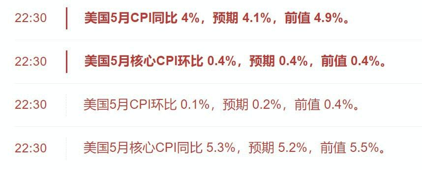
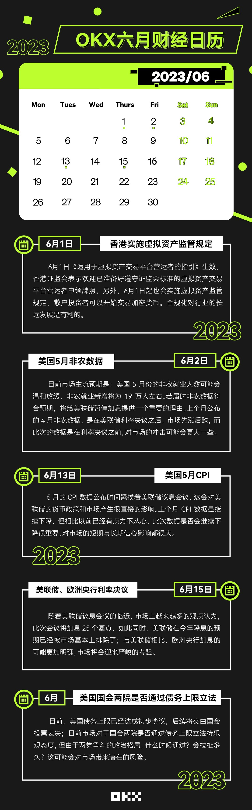

# 2023年6月

- 6月1日香港实施虚拟资产监管规定。利好。
- 6月2日美国5月非农数据。中性。
- 6月13日美国5月CPI。利空。
- 6月15日美联储暂停，将基准利率维持在5.00%-5.25%区间不变，自2022年3月以来的连续10次加息暂告一段落。今年不降息。利空。
- 6月美国国会两院是否通过债务上限立法。

## 6月24日
[Arthur Hayes 博文: 美国监管加剧 香港欢迎加密货币 这意味着什么？](https://www.wu-talk.com/index.php?m=content&c=index&a=show&catid=47&id=15297)

## 6月15日
普遍下跌3%-5%
- 美联储暂停加息了，将基准利率维持在5.00%-5.25%区间不变，自2022年3月以来的连续10次加息暂告一段落。

## 6月14日

## 6月13日
- CPI低于预期，但是核心CPI高于预期。算是略微利好，不一定能持续上涨，又得看看15号加息决议了，炒个币，这个数据那个数据…我们真是不容易哈。

## 6月12日

## 6月11日（周日）

## 6月10日（周六）
sec概念312级别暴跌。青城山
- robinhood下架sol,ada,matic等

## 6月9日

## 6月8日

## 6月7日
- 目前来看我个人感觉币安刑事问题不会太严重。美国 sec 发疯，是因为围绕证券定义没有共识(不像韩国)，双方差距太大，只能诉诸一级级法院了。刑事主要涉及洗钱。这点有明确共识。币安也一直高度配合(除了早年有些漏洞)。之前被刑事处罚的老黑，是完全不配合甚至嘲讽攻击。我个人觉得刑事问题不会太大。
- 对于 Binance 本身和 Binance US 的平台用户资产，目前是没有冻结禁令的。币安创始人 CZ 也已经发推声明过 Binance 平台资金是安全的。https://storage.courtlistener.com/recap/gov.uscourts.dcd.256060/gov.uscourts.dcd.256060.4.1.pdf
- 1200亿美元数字币资产涉嫌非法证券！霉国SEC要是赢了，币圈将会巨变：
自霉国证券交易委员会（SEC）对币安和Coinbase提起诉讼后，被霉国监管机构视为未注册证券的加密货币现已超过1200亿美元。
SEC在以上两大诉讼中提到了十多种代币，并称这些代币是理应在SEC注册的证券。
在此次对币安的诉讼中，币安发行的代币BNB——市值440亿美元和稳定币BUSD、Cardano的ADA、Solana的SOL、Polygon的MATIC、Filecoin的FIL和Algorand的ALGO均被归类为证券。而在对Coinbase的诉讼中，NEAR代币和Dfinity的ICP代币被视为证券。
加上此前提到的XRP等其他代币，SEC现已将超过1200亿美元的代币归类为未注册证券。作为对比，根据CoinGecko的数据，全球加密货币市值约为1.1万亿美元，在新冠疫情的繁荣期间，其市值一度超过3万亿美元。
如果SEC赢得诉讼，整个币圈势必会迎来一场巨变，行业运作方式必须向监管看齐，届时各大玩家将何去何从？

## 6月6日
昨晚大暴跌，史诗级。sui直接从0.97+跌到0.71。
- [币安和CZ遭美国SEC起诉：五要点分析 大量代币列为证券 刑事悬而未发？](https://mp.weixin.qq.com/s/lrBBt69GcVb63QEcFSn2SA)

## 6月5日
早上卖了一丢丢。感觉有下跌趋势。
- ADA、MATICSEC将SOL、FIL、ATOM、SAND等列为证券
6月5日消息，SEC 在针对 Binance 的诉讼文件中提到，被列为证券的加密货币包括但不限于 BNB、BUSD 以及以下各和加密资产: SOL、ADA、MATIC、FIL、ATOM、SAND、MANA、ALGO、AXS 和COTl.
## 6月4日
横盘

## 6月3日
上涨

## 6月2日

- 吴说获悉，美国公布5月失业率 3.7% 超过预期，为2022年10月以来新高。预期值为3.50%，前值3.40%。美国5月季调后新增非农就业人口 33.9万人，为2023年1月以来最大增幅，预期19.0万人，前值25.3万人。

## 6月1日
- 
- 6月日历。
