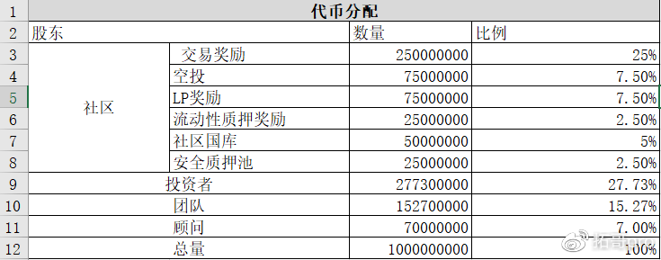
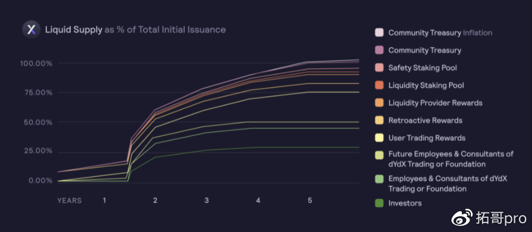
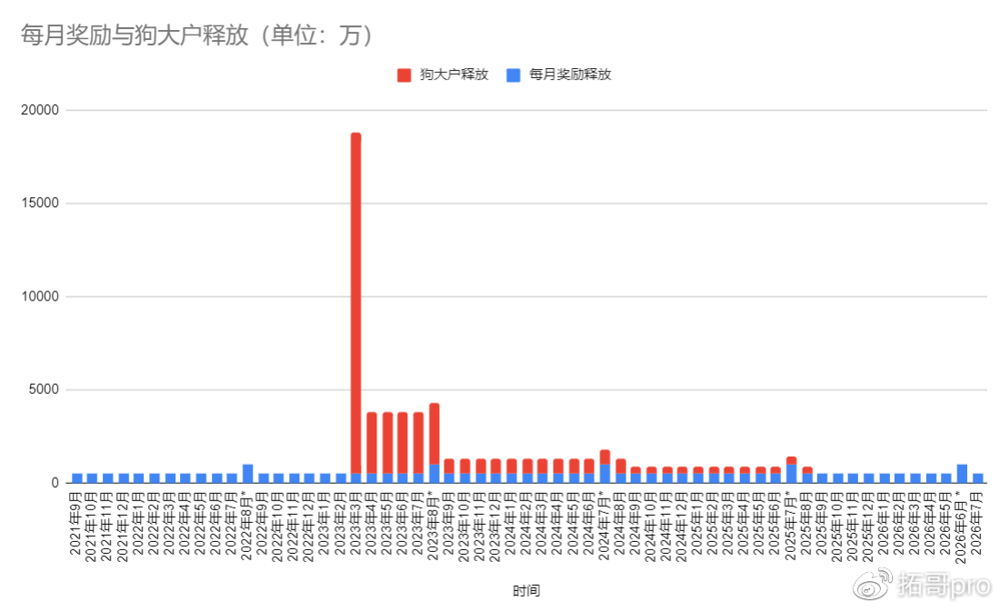

# Dydx
dydx的代币分配规则没有写得很详细，比如说国库和质押奖励的规则。国库的代币解锁应该不会造成抛压所以这部分的代币就忽略了。质押奖励的释放规则没看到，而且占比也就2.5%，跟其他的代币释放比起来就太小了，所以也忽略了。

## 代币分配：  

 
从代币分配看，50%给了社区，50%给了团队，投资者和顾问。其中交易挖矿，LP奖励，空投，流动性质押奖励占总的代币分配的42.5%。加上投资人，团队，顾问的50%份额，总量82.5%的份额可能会抛向二级市场。具体有多少要看各方对DYDX的格局和态度了。

## 释放规则：

### 交易/LP挖矿：

每一轮挖矿28天，持续时间为五年，每轮的交易挖矿奖励3835616个dydx，每轮的LP奖励1150685，每轮的总共奖励4986301个dydx。由于epoch的时间是28天，所以一年会有13轮奖励。具体每轮的时间见这里。

### 狗大户：投资者，团队，顾问

狗大户的代币释放方式是：  
30%代币锁仓18个月，然后直接全部释放。  
40%的代币在第18-24个月内线性释  
20%的代币在第25-36月内线性释放  
10%的代币在第37-48月内线性释放  

### 奖励质押

奖励质押的规则没有查到，而且奖励质押的占比也仅有2.5%。所以我选择性忽略了

### 国库和保池

这部分的代币释放应该不会造成抛压，所以这部分也忽略了

## 简单说：
- 2022年 — 2023年2月
每月奖励释放有498w代币  
2022年8月共有两轮奖励，共释放997w代币
- 2023年3月 — 2023年8月：
每月释放498w代币。其中23年8月双份奖励，释放997w代币  
其中23年3月，投资人，团队，顾问的30%代币全部解锁了，一共释放18333万代币，加上当月的交易挖矿与Lp挖矿奖励，23年3月一共接近1.9亿个。
每月投资人，团队，顾问线性解锁约3333w代币
- 2023年 9月 — 2024年8月
每月释放498w代币。其中24年7月双份奖励，释放997w代币  
投资人，团队，顾问 每月线性释放一共833w代币
- 2024年9月 — 2025年8月
每月释放498w代币。其中25年7月双份奖励，释放997w代币  
投资人，团队，顾问 每月线性释放一共416.7w代币
- 2025年9月 — 2026年7月
每月释放498w代币。其中27年6月双份奖励，释放997w代币

## 可能抛压环比通胀率

## 总结
- 21年8月—26年7月，每月平均540w+的交易/质押代币奖励 释放
- 2021年8月 — 2023年2月：可能抛压的环比通胀率从6.23%缓慢下降至2.94%，每月通胀较高。
- 2023年3月投资人，团队，顾问的一次性解锁1.5亿。那时，市场上流通的代币大约1.75亿个。
- 23年3月-23年8月，投资人，团队，顾问每月解锁3333w。由于投资人，团队，顾问代币的解锁，可能抛压的通胀率最低都有8%。
- 23年9月 — 24年8月，投资人，团队，顾问每月释放833w。投资人，团队，顾问的第一，第二波解锁过后，可能抛压的环比通胀率从2.38% 缓慢下降至 1.87%。
- 24年9月 — 25年8月，投资人，团队，顾问每月释放416.7w。可能抛压的环比通胀率为1.2左右。算是回归到一个较低的区间了。
- 25年9月 — 26年7月，投资人，团队，顾问的代币解锁完全，仅有交易奖励和LP奖励了，可能抛压的环比通胀率下降至约0.6%。