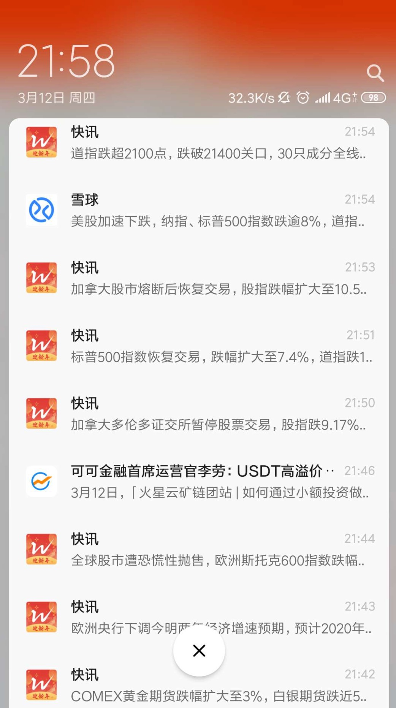

# 2020大事件

## 2020.1
1.24 农历新年

## 2020.2
OKC上线测试网，okb从3拉升到7（宣布全部销毁尚未发行的7亿OKB）

coinmex倒闭了：CoinMex将于新加坡时间2020年2月26日16:00，对平台上所有的币对（包括币币、法币）进行下架处理，并关闭所有币种的资产充值及提现功能。

火币公链测试网于2020年2月29日正式上线。

## 2020.3
“减半行情”还存在吗？当时很多人（比如江卓尔，renrenbit赵东）都是乐观的，并没有预测到312到来。  
### 3月12日 币圈/美股（全球股市）都暴跌
3.12暴跌，BTC从年初的10500跌至3700 

启发：关于机遇，根本不用提前透支未来，市场一直有机会。

### 3月13日
- 为什么说区块链减半是认知骗局？  
- 【道指重挫近10% 创1987年以来最大单日跌幅】财联社3月13日讯，美东时间周四，美国三大股指再度集体暴跌，其中，道指收盘暴跌逾2300点或9.99%，创1987年黑色星期一以来最大单日跌幅；标普500指数大跌9.51%，创1987年10月以来最大单日跌幅；纳指跌9.43%；三大股指收盘均跌入技术性熊市。大型科技股集体大跌，苹果跌9.88%，亚马逊跌7.92%，奈飞跌9.91%，谷歌跌8.2%，Facebook跌9.26%，微软跌9.48%。中概股阿里巴巴跌6.89%，京东跌7.87%，百度跌8.55%。 #美股创32年最大跌幅#

Ripple锁定XRP托管释放的90％，首席执行官承认依靠销售XRP来盈利  
Summer Party酝酿中，当时并不知道
### 3月15日
美联储15日突然大规模降息，将联邦基金利率目标区间大幅下调至0-0.25%，为应对股市暴跌，美联储刚刚在3月3日紧急降息50个基点，如此密集的降息十分罕见。2008年金融危机后，美联储为挽救经济，曾一路降息至0-0.25%的超低水平，此后延续了7年的零利率政策。

美联储声明称，新冠疫情已经给包括美国在内的很多国家的社会和经济造成损害。全球金融环境受到显著影响。本次降息将有助于支持美国经济、稳定就业市场、维持通胀目标。
　　与这次降息相配合，美联储还宣布了7000亿美元大规模的量化宽松计划，包括几个月内回购至少5000亿美元国债，增持至少2000亿美元规模的抵押担保证券。这一举动也非同寻常。2008年金融危机后，美联储先后推出至少三轮量化宽松。首轮量化宽松，也就是金融体系最危急的时候，美联储直接购买“两房”债务及其抵押担保证券，此举支持金融机构信用，及时稳定了市场。

### 3月16日
3月16日起，央行推出的定向降准措施正式实施。此次为普惠金融定向降准，并额外加大了对股份制银行的降准力度，共释放长期资金5500亿元。

标普500指数开盘跌超7%，触发本月第三次熔断，也是史上第四次熔断，美股暂停交易15分钟

### 3月17日
【美国三大股指暴跌约12% 为33年来最大跌幅】美股暴跌，道指盘初跌约2200点，标普500指数开盘即跌超7%，触发熔断，全市场开盘后立即暂停交易15分钟，恢复交易后道指跌幅有所收窄，但尾盘继续下行，截至收盘，道指跌12.94%，报20186.55点，险守二万点关口，标普500指数跌11.98%，报2386点，纳指跌12.32%，报6904点。为33年来最大跌幅。 #美股创下33年最大跌幅#
盘面上，除黄金、白银板块外几乎全线板块走低，航空股、科技股大幅疲软。个股方面，特斯拉收跌18.58%，股价较2月高点已腰斩；苹果跌12.86%，微软跌14.7%，阿里巴巴跌7.39%，美国航空集团逆市收涨11.25%。

### 3月23日
美联储宣布广泛新措施来支持经济，包括了开放式的资产购买，本周每天都将购买750亿美元国债和500亿美元机构住房抵押贷款支持证券，每日和定期回购利率报价利率将重设为0%。
美联储宣布，扩大货币市场流动性便利规模；为企业债新设两个流动性工具；将很快宣布“主体街（Main Street）商业贷款项目”以支撑中小型企业贷款，为联邦中小企业局的措施提供补充；为确保市场运行和货币政策传导，将不限量按需买入美债和MBS。
### 3月24日
【美联储：将不限量按需买入美债和MBS】美联储宣布广泛新措施来支持经济，为确保市场运行和货币政策传导，将不限量按需买入美债和MBS。本周每天都将购买750亿美元的国债和500亿美元的机构住房抵押贷款支持证券（MBS）。每日和定期回购利率报价利率将重设为0%。美联储表示，将很快宣布“主体街（Main Street）商业贷款项目”以支撑中小型企业贷款，为联邦中小企业局的措施提供补充。（界面）

 #美联储宣布救市新计划#
### 3月25日
【道指收盘大涨超2100点 创1933年以来最大单日涨幅】美股强势走高，截至收盘，道指上涨11.37%，单日涨超2100点，创1933年以来最大单日涨幅，为历史第五大单日涨幅；纳指收涨8.12%，标普500指数涨9.38%。#美股报复性反攻道指涨超千点#

大型科技股集体走高，特斯拉涨超16%，苹果涨超10%，微软涨超9%，Facebook涨超8%，谷歌涨超7%。

热门中概股集体上涨，趣头条涨超19%，瑞幸咖啡涨超15%，网易有道涨超14%，蔚来汽车、哔哩哔哩涨超9%，京东涨超6%，拼多多、百度、阿里巴巴、新浪涨超5%，腾讯ADR涨超4%。

欧洲股市集体大涨，德国DAX指数涨10.98%，报9700.57点；英国富时100指数涨9.05%，报5446.01点；法国CAC40指数涨8.39%，报4242.70点；意大利富时指数涨8.93%，报16948.60点。欧洲斯托克50指数涨9.98%，报2733.55点。

COMEX 4月黄金期货收涨93.20美元，涨幅5.95%，报1660.80美元/盎司。
### 3月26日
【美股冲高回落三大股指涨跌不一 道指涨近500点】美股冲高回落，三大股指涨跌不一。截至收盘，道指涨495.64点，涨幅2.39%，报21200.55点；纳指跌33.56点，跌幅0.45%，报7384.30点；标普500指数涨28.23点，涨幅1.15%，报2475.56点。

大型科技股普遍下跌，奈飞跌超4%，Facebook、谷歌、亚马逊跌超2%，苹果跌0.55%。道指成分股中，波音收涨24%，联合技术涨超10%，耐克涨超9%。 

热门中概股涨跌不一，万达体育涨超17%，欢聚时代、蔚来汽车涨超6%，迅雷、虎牙涨超5%，搜狗涨超4%，老虎证券、拼多多、猎豹移动、哔哩哔哩涨超3%，瑞幸咖啡、搜狐、腾讯ADR、阿里巴巴、网易有道、58同城涨超1%；唯品会跌超7%，网易跌近5%，陌陌跌超2%，腾讯音乐、微博跌超1%。

欧洲股市集体收涨，德国DAX指数收盘上涨1.79%，报9874.26点；英国富时100指数涨4.45%，报5688.20点；法国CAC40指数涨4.47%，报4432.30点；意大利富时指数涨1.74%，报17243.68点；欧洲斯托克50指数上涨2.60%，报2804.55点。

COMEX 4月黄金期货收跌27.40美元，跌幅1.65%，报1633.40美元/盎司。

WTI 5月原油期货收涨0.48美元，涨幅2.00%，报24.49美元/桶。布伦特5月原油期货收涨0.24美元，涨幅0.88%，报27.39美元/桶。
### 3月27日
二十国集团将启动总价值5万亿美元的经济计划，以应对疫情对全球社会、经济和金融带来的负面影响。#G20启动5万亿美元提振计划#

## 2020.4
暴跌后的修复期，BTC和ETH都在低位徘徊，分别5000+和120+  
Summer Party酝酿中，当时并不知道

## 2020.5
BTC减半。BCH和BSV提前几天减半，各大媒体访谈名人观点。  
5月11日“炉火不眠夜”视频直播活动：熬夜看减半直播，孙宇晨，何一，矿圈大佬等都分享自己的观点，并预测币价  
defi崛起，已引起注意，并开始研究

### 5月10日
据CoinMarketCap官方消息，加密货币资讯网站 CoinMarketCap 创始人兼 CEO Brandon Chez 在币安收购后宣布离职，由现任首席战略官 Carylyne Chan 担任临时首席执行官。
Brandon Chez 表示，在经营这家公司 7 年之后，将计划回归家庭，但仍担任 CoinMarketCap 顾问一职。币安刚刚宣布正式收购加密货币行情网站 CoinMarketCap，双方并未公开收购额，但媒体 The Block 表示据消息人士称本次收购花费为 4 亿美元。
币安表示，收购后，CoinMarketCap 将继续作为独立主体进行运营。

## 2020.6
Summer Party正式开启：comp, yfi, uni, crv, snx（疯涨并没有赶上）  
团队为期一个月学习分享defi项目

## 2020.7
yfi起飞，从3到30000，万倍涨幅（南戴河）  
月底的时候开始上涨突破10000。第一次感受暴涨  

## 2020.8
defi第一轮过热，开始顶部震荡（买入即被套）

## 2020.9
defi第一轮，彻底偃旗息鼓，开始普遍下跌。crv跌幅最大

## 2020.10
在defi余热下，CEX高息理财Earn随处可见，50%，100%很常见。  
launchpad/jumpstart IEO一个接一个。  
10月中旬，正式开始上涨

## 2020.11
一路上涨不回头  
OK，Huobi先后遭遇山西警方约谈，分别持续一个多月，两个多月。（欢乐豆行情）  
此时，组里有人花17万买一手茅台

## 2020.12
BTC，ETH先后突破2017年12月的前高，引发媒体报道  
山西事件后，徐坤消失  
初始挖矿OKT
