# 2022大事件

## 2022.1
1.31 中国新年  
cz身家排行榜再次成为由盛转衰的最后标志。

## 2022.2

## 2022.3

## 2022.4
Terra暴雷，ust先脱锚

## 2022.5
几天后，Luna大跌。在几美元的时候开空被爆仓。从100多跌到0.0000x。期间交易所有段时间不能充提。  
此次大跌，传言有个腾讯女员工做空赚千万以上。  

拜登签署加密监管行政命令, 美国财政部制裁 Tornado Cash  

### 5月15日
本轮暴跌的原因是什么？
1：Luna和ust继续暴跌，市场熊市恐慌情绪蔓延，Luna市值只剩下1940万美金。
2：美国通货膨胀率依然居高不下，美联储官员表示，下次加息可能会提高到75基点，美股暴跌联动，跟全球的经济环境有关
3：合约爆仓，defi资产被强制清算，Luna基金会抵押出去的币抛压的预期

## 2022.6
到达低谷，感觉一切白玩，又回到贫穷状态。  
6.18 打折促销，跌至最低点。三箭,Celsius流动性危机，BTC，ETH下一个台阶。BTC 17500，ETH 893  
15万人爆仓上百度热搜。看到1.5万，1万，6000的大有人在。充斥着xx玩币破产的故事（跟2021.4暴富神话满天飞形成鲜明对比）。都在讨论美团外卖。

## 2022.7
开启反弹  
公司继续扩张  
aptos开始预热  
二层网络op上主网  

小交易所aex，虎符跑路。

## 2022.8
反弹到高点，BTC 25000，ETH 2000  
南戴河，阿那亚

## 2022.9
9.15。ETH Pow->Pos。提高 99.95% 的能源效率和减少 90% 的碳排放量。  

被标记为 Justin Sun 的地址（0x176F3开头）近 4 日加仓 20,633 枚 ETH。当前该地址累计持有 268,280 枚 ETH。  
解评：前几天直播有人在问，孙宇晨一下子买这么多以太坊，说明什么呢？对于孙宇晨来说20000枚eth对于他的整个加密货币的仓位来说算是一个一般比例。这次是真正把卖出去的买回来，还是说为ETHW服务不得而知。不过从我去年观察孙宇晨来看，他的好几次交易都是卖在了较高点，买在了较低点，比三箭资本强很多了。

## 2022.10
aptos主网上线  
币安 DID（灵魂绑定）花10u

## 2022.11
11.9 ftx暴雷，牵扯Genesis(GCT),Alameda。BTC再下一个台阶，到15500，ETH没创新低  
终于发江卓尔没有深熊的言论是错的，再无大神。江卓尔仍然嘴硬，深熊是跌幅深，时间长，现在时长不满足。

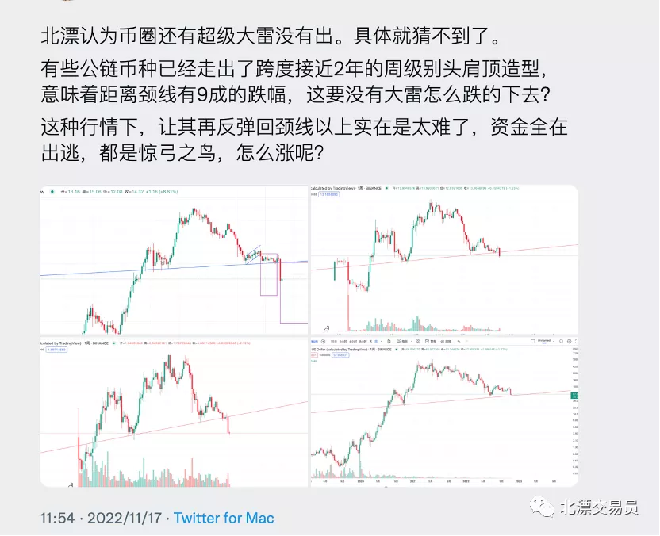
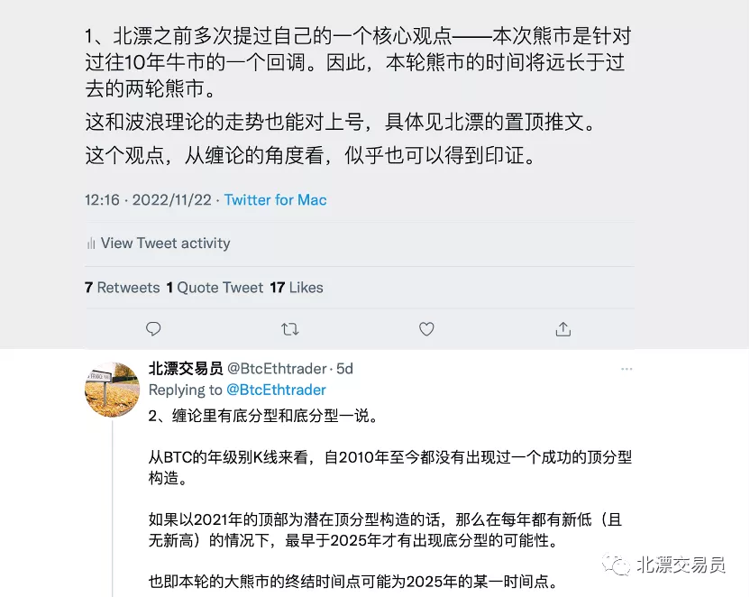
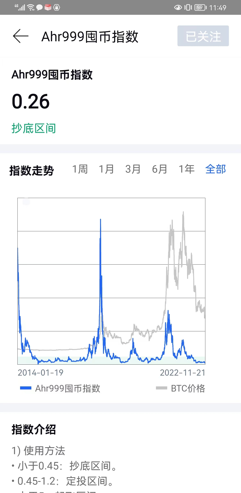
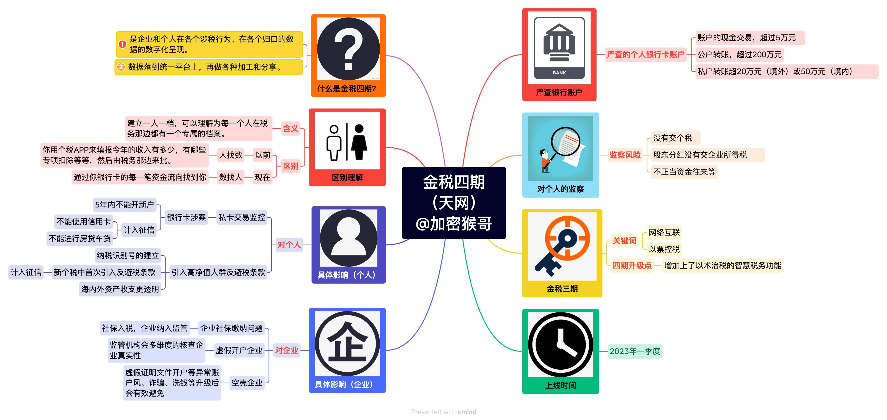

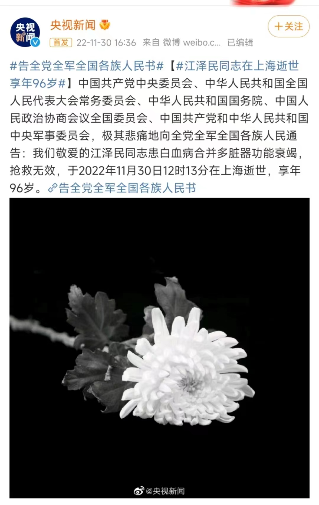
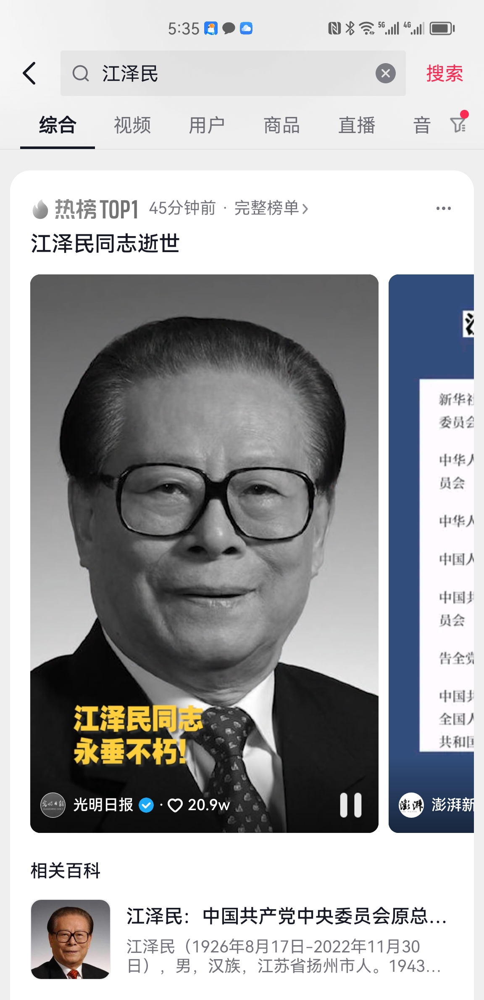

## 2022.12
交易最清淡的一个月，数据显示CEX交易量下跌40-50%。开启裁员模式，除币安外。

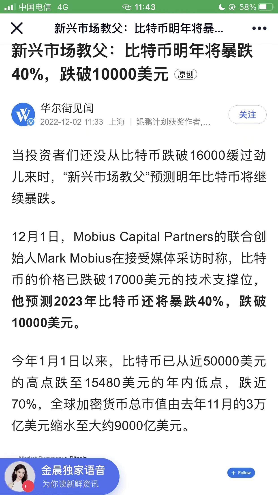
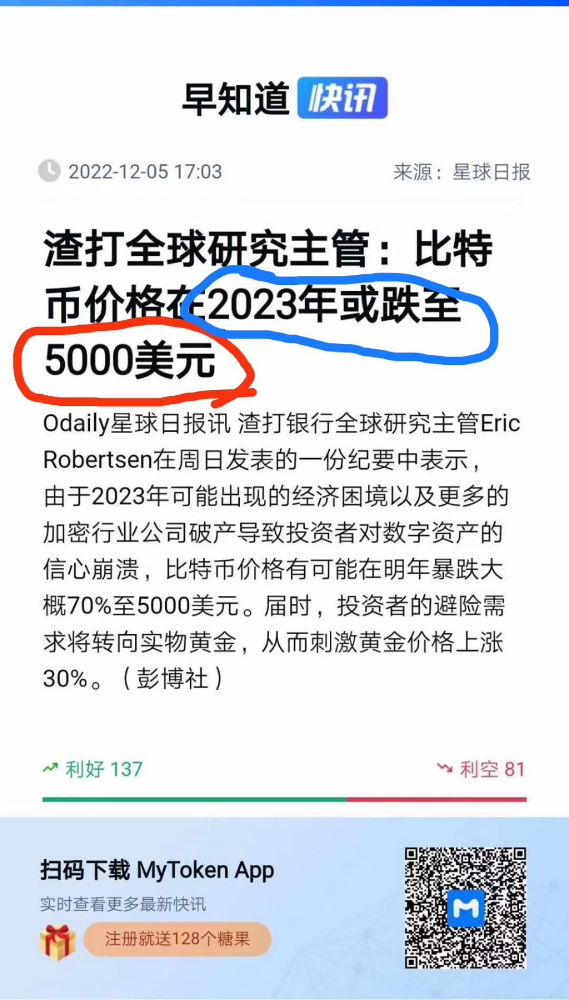
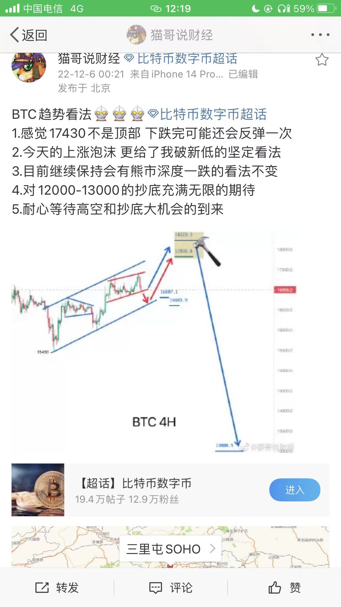
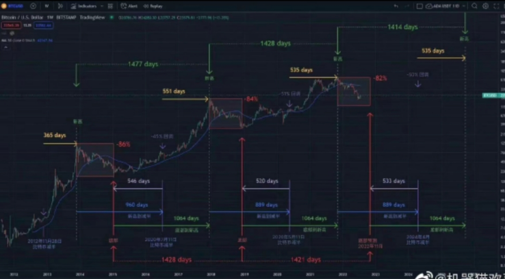
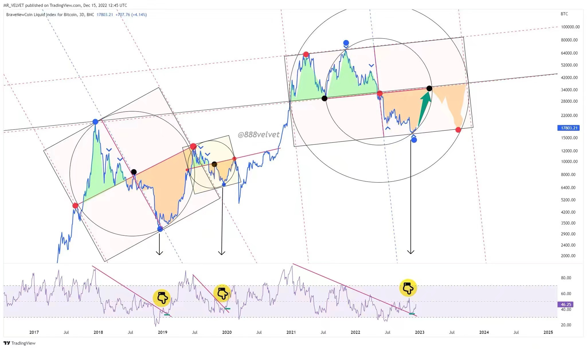
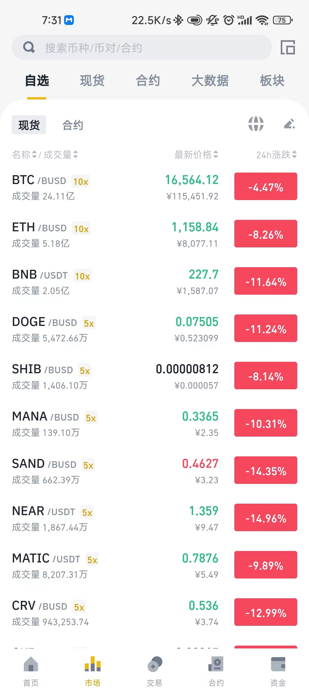
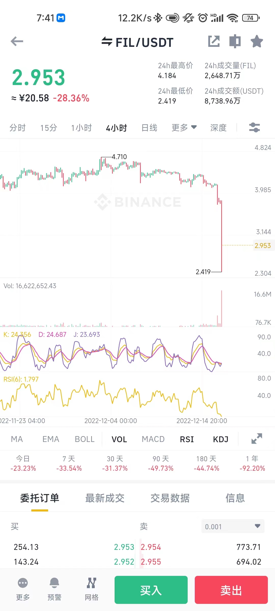

### 12.28  
吴说获悉，MicroStrategy 宣布购买了 2500 BTC，截至 12月27日共持有约 132,500 个比特币，以约 40.3 亿美元的价格收购，平均价格为每个比特币约 30,397 美元。

### 12.19
- 币安美国10亿美元收购Voyager。
- 印尼交易所Tokocrypto已被币安正式收购，约58%员工被解雇。
- 灰度CEO：若无法将GBTC转为BTC ETF，或将对已发行的信托基金进行要约收购。
- 四大，不愿意对私人加密公司进行储备证明审计